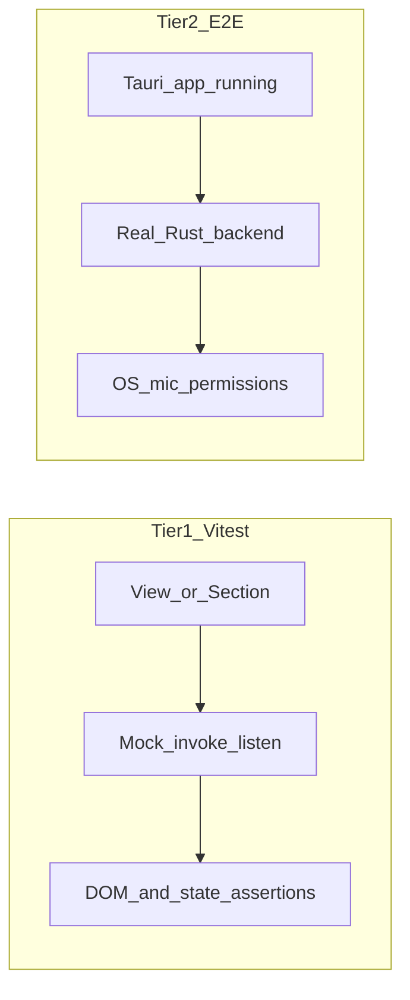
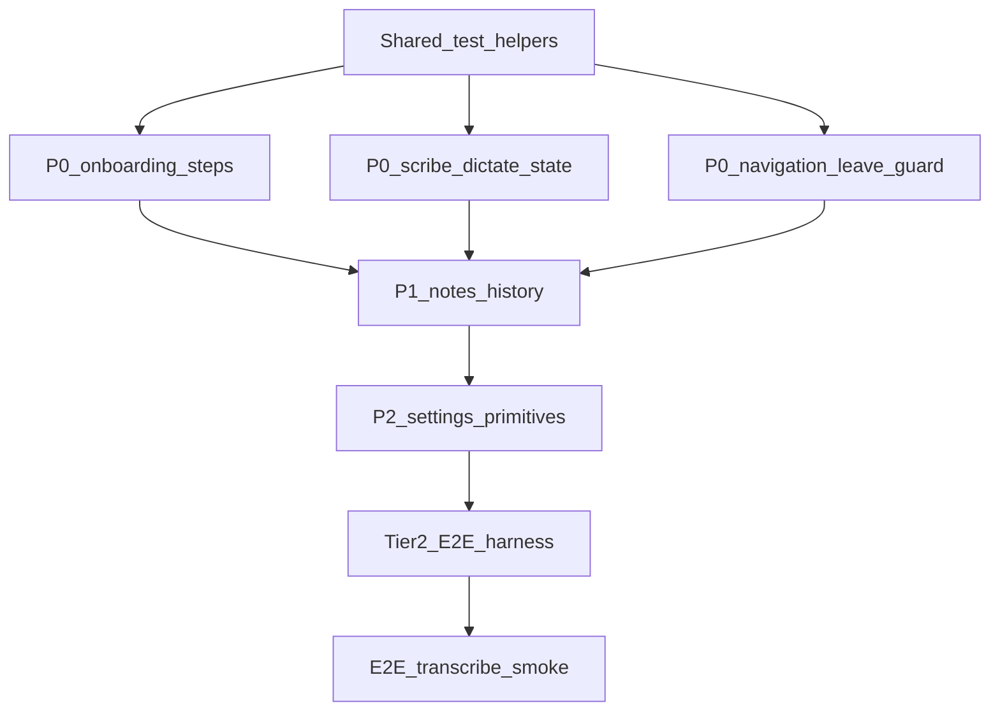

# Key User Flows for Frontend Test Automation

## Current baseline

| Layer | Stack | Status |
|-------|-------|--------|
| **Tier 1** | Vitest + `@testing-library/svelte` + jsdom | Configured in [vitest.config.ts](vitest.config.ts); Tauri stubs in [src/test/setup.ts](src/test/setup.ts) |
| **Tier 2** | Playwright / `tauri-driver` against built app | **Not set up** — no `e2e/` folder, no Playwright in [package.json](package.json) |

**Already covered (Tier 1):**
- [DictatePracticeStep.test.ts](src/lib/ui/4_sections/onboarding/DictatePracticeStep.test.ts) — dictate state events, auto-enter toggle
- [noteLeaveGuard.test.ts](src/lib/services/noteLeaveGuard.test.ts) — note editor leave-guard decision tree
- [captureProgress.test.ts](src/lib/stores/captureProgress.test.ts), [processingFeedback.test.ts](src/lib/utils/processingFeedback.test.ts), [modelDownload.test.ts](src/lib/stores/modelDownload.test.ts)

**Pattern to reuse:** mock `invoke` return values + simulate `listen` callbacks (`dictate://state-changed`, `scribe://state-changed`, etc.) — same approach as `DictatePracticeStep.test.ts`.

---

## Tier 1 — Automate now (Vitest + mocked IPC)

These flows are **frontend-owned**: state machines driven by Tauri events, navigation, modals, and form wiring. No real mic, Whisper, or OS paste required.

### P0 — Shell navigation and guards

| Flow | Source | What to assert | Key files |
|------|--------|----------------|-----------|
| **Sidebar route changes** | App shell | Click Home / Notes / Upload / Settings → correct route; settings sidebar replaces app sidebar | [+layout.svelte](src/routes/+layout.svelte), [AppSidebar.svelte](src/lib/ui/6_regions/AppSidebar.svelte) |
| **TitleBar Record → new note** | Note create §6a | `goto('/notes/new')` fires; redirect to `/notes/[id]` after mocked `note_create_empty` | [TitleBar.svelte](src/lib/ui/6_regions/TitleBar.svelte), [notes/new/+page.svelte](src/routes/notes/new/+page.svelte) |
| **Note leave guard (UI wiring)** | §6f | Modal appears for metadata-only empty note; silent delete path; proceed-while-recording — extend beyond pure `noteLeaveGuard.ts` into [note-editor.svelte](src/lib/ui/5_views/note-editor.svelte) + layout `beforeNavigate` | [noteLeaveGuard.ts](src/lib/services/noteLeaveGuard.ts), [+layout.svelte](src/routes/+layout.svelte) |
| **Delete confirm modal** | §5e | Card delete sets `deleteTarget`; confirm calls `history_delete`; "Don't ask again" skips modal | [+layout.svelte](src/routes/+layout.svelte), [notes.svelte](src/lib/ui/5_views/notes.svelte) |

### P0 — Onboarding wizard

| Step | Flow | What to assert | Key files |
|------|------|----------------|-----------|
| 1 Welcome | §0 | Get started advances; Skip calls `settings_complete_onboarding` + `settings_show_window` | [WelcomeStep.svelte](src/lib/ui/4_sections/onboarding/WelcomeStep.svelte) |
| 2 Model | §0 | Continue disabled until `downloaded`; skip when `model_list` has downloaded model; `model_select` on continue | [ModelDownloadStep.svelte](src/lib/ui/4_sections/onboarding/ModelDownloadStep.svelte), [modelDownload.svelte.ts](src/lib/stores/modelDownload.svelte.ts) |
| 3 Permissions | §0 | Continue disabled until mic granted; optional rows don't block | [PermissionsStep.svelte](src/lib/ui/4_sections/onboarding/PermissionsStep.svelte) |
| 4 Dictate practice | §0 | **Partially done** — extend: RECORDING indicator, ERROR hint, auto-enter persists via `settings_set_dictate_auto_enter` | [DictatePracticeStep.svelte](src/lib/ui/4_sections/onboarding/DictatePracticeStep.svelte) |
| 5 Voice enrollment | (new vs action-flows) | Step skip when profiles exist; enrollment UI states from mocked `voiceprint_*` events | [VoiceEnrollmentStep.svelte](src/lib/ui/4_sections/onboarding/VoiceEnrollmentStep.svelte) |
| 6 Feature tour | §0 | Done calls `settings_complete_onboarding` + window close | [FeatureTourStep.svelte](src/lib/ui/4_sections/onboarding/FeatureTourStep.svelte) |
| Orchestration | §0 | `skipModelStep` / `skipVoiceStep` jump logic; step indicator count | [onboarding.svelte](src/lib/ui/5_views/onboarding.svelte) |

### P0 — Scribe UI state machine (no real audio)

| Flow | What to assert | Events to simulate |
|------|----------------|-------------------|
| **Idle → Start Recording** | `scribe_start` invoked with mic/speaker flags; phase → `recording`; timer/levels update | `scribe://state-changed` RECORDING, `scribe://audio-level` |
| **Recording controls** | Mic dropdown locked only during transcribing; speaker toggle calls `scribe_toggle_speaker_capture` | [scribeController.svelte.ts](src/lib/stores/scribeController.svelte.ts) |
| **Stop → Transcribing → Done** | Progress bar + stage labels; NO_MODEL and ERROR surfaces; **never auto-start on navigate** (regression) | `scribe://state-changed` TRANSCRIBING/DONE/NO_MODEL/ERROR + `processing_stage` |
| **Record again** | Done → idle; user must press Start again (except error Try again) | [docs/scribe-ui-review.md](docs/scribe-ui-review.md) |

### P0 — Dictate floating panel (satellite window)

| Flow | What to assert | Events |
|------|----------------|--------|
| **State HUD** | IDLE hidden; RECORDING/TRANSCRIBING/PASTING show correct copy + progress | `dictate://state-changed` |
| **Abort (X)** | Cancel during TRANSCRIBING returns to idle | [dictate.svelte](src/lib/ui/5_views/dictate.svelte) |
| **History write failure** | `history_write_failed` surfaces non-blocking warning | same |
| **TitleBar dictate chip** | Mirrors dictate state in main shell | [TitleBar.svelte](src/lib/ui/6_regions/TitleBar.svelte) |

### P1 — Transcribe / Upload screen

| Flow | What to assert | Events |
|------|----------------|--------|
| **File + model selection** | Transcribe button disabled until file + model chosen | [transcribe.svelte](src/lib/ui/5_views/transcribe.svelte) |
| **Single-file run** | IDLE → processing → Done with path; Open Transcript visible when `transcript_path` set | `transcribe://state-changed` |
| **Batch queue** | Multi-file progress uses batch creep (`captureProgress` batch mode) | `transcribe://item-progress` |
| **Dual-source folder detection** | UI indicates session folder when `mic.wav` + `session.json` (mock picker result) | action-flows §4 step 7 |

### P1 — Notes / History UI

| Flow | What to assert | IPC mocks |
|------|----------------|-----------|
| **List filters** | All / Scribe / Dictate / Upload / Written tabs filter correctly | Fixture `HistoryListItem[]` in [notes.svelte](src/lib/ui/5_views/notes.svelte) |
| **Tag filter panel** | Tag toggle narrows list | `fetchTagVocabulary` |
| **Open store note** | Navigates to `/notes/[id]` | — |
| **Open transcript item** | Fullscreen `NoteDetailPane`; list chrome hidden | `history_get_detail`, `history_render_markdown` |
| **Detail prev/next** | Chevrons cycle within active filter tab | [NoteDetailPane.svelte](src/lib/ui/4_sections/NoteDetailPane.svelte) |
| **Export / Open / Copy** | Export enables Open; legacy `md::` / `dictate::` hide delete/export | §5b–5f |
| **Home recent** | Recent cards render; See all → `/notes` | [home.svelte](src/lib/ui/5_views/home.svelte) |

### P1 — Note editor

| Flow | What to assert |
|------|----------------|
| **Load + autosave** | Title/body debounce calls `note_save_*` only when dirty |
| **Attach transcript strip** | On `scribe` completion, `note_attach_transcript` + transcript panel renders |
| **Delete note** | Same modal path as history delete |
| **Metadata sidebar** | Tag changes call `note_set_tags`; `note://item-updated` triggers list refresh (mock listener) |

### P2 — Settings tabs

| Tab | Flow | Assert |
|-----|------|--------|
| General | Toggle markdown save, WAV retention, theme | `settings_get_*` / `settings_set_*` round-trip |
| Permissions | Status rows + request buttons | Polled `settings_permissions_status` |
| Models | Download/select/remove | Reuse [modelDownload.test.ts](src/lib/stores/modelDownload.test.ts) patterns |
| Voice | Learning toggles, profile list, remove embeddings confirm | [setting_voice.svelte](src/lib/ui/5_views/setting_voice.svelte) |
| Replacements | Add/edit/delete rule; scope chips | [setting_replace.svelte](src/lib/ui/5_views/setting_replace.svelte) |
| Help | Restart onboarding → `settings_reset_onboarding` + `settings_show_onboarding_window` | [setting_help.svelte](src/lib/ui/5_views/setting_help.svelte) |

### P2 — Design system / primitives (from backlog [0043](docs/backlog/active/0043-component-behaviour-tests.md))

Button, Toggle, NoteCard, FilterRow, Accordion — low-level interaction contracts that many flows depend on.

---

## Tier 2 — E2E later (running Tauri app)

Reserve for **cross-layer smoke tests** once Playwright + `tauri-driver` (or WebDriver) is added. These validate real IPC + filesystem + config persistence; keep the set small.

### Recommended E2E smoke suite (5–8 tests)

| # | Flow | Why E2E | Hardware gate |
|---|------|---------|---------------|
| 1 | **App launches → Home** | Real tray/window bootstrap | None |
| 2 | **Settings round-trip** | Config write/read on disk | None |
| 3 | **Transcribe fixture WAV** | Real Whisper + history append + optional `.md` | Needs tiny model in CI cache |
| 4 | **History list after transcribe** | Real `history.jsonl` merge | Depends on #3 |
| 5 | **Note create → type → reload** | Sidecar autosave `.notes/{id}/` | None |
| 6 | **Onboarding skip path** | Window lifecycle + `onboarding_complete` flag | None |
| 7 | **Scribe record short clip** | Full capture pipeline | **Mic required** — `#[ignore]` locally |
| 8 | **Dictate paste** | OS injection / clipboard | **Accessibility + focus target** — manual/ignored in CI |

### Explicitly defer from CI E2E

- Hold-to-talk / modifier key sequences (§3a–3b) — OS input monitoring
- Dual-source loopback / BlackHole routing (§2) — macOS audio routing
- Voice enrollment with real embeddings — model + mic
- Permission grant dialogs — system modals not automatable headlessly

---

## Suggested implementation order

1. **Add `src/test/ipcFixtures.ts`** — reusable mocks for `history_list`, `history_get_detail`, `model_list`, and event emitters for `scribe://`, `dictate://`, `transcribe://`.
2. **P0 flows** — onboarding orchestration, scribe/dictate state machines, shell navigation + leave guard UI.
3. **P1 flows** — notes list/detail, transcribe screen, note editor autosave.
4. **P2** — settings tabs + [0043](docs/backlog/active/0043-component-behaviour-tests.md) primitives.
5. **Tier 2** — add `e2e/` + Playwright config; start with transcribe-on-fixture + settings persistence (no mic).

---

## Test harness conventions (align with existing code)

- Co-locate: `Foo.svelte` → `Foo.test.ts` beside it (see [0043](docs/backlog/active/0043-component-behaviour-tests.md)).
- Mock at module boundary (`@tauri-apps/api/core`, `event`, `window`) — extend [src/test/setup.ts](src/test/setup.ts) only for global defaults; per-test overrides via `vi.mocked(invoke).mockImplementation`.
- Prefer **event-driven simulation** over testing internal `$state` — mirrors how the real app works.
- Assert **user-visible outcomes** (labels, buttons enabled/disabled, navigation) not CSS tokens.
- Update [docs/action-flows.md](docs/action-flows.md) if onboarding step numbering diverges (Voice step 5 is in code but thin in docs).

---

## Coverage map (flows → test tier)

| User flow (action-flows) | Tier 1 | Tier 2 |
|--------------------------|--------|--------|
| §0 Onboarding | Full (mocked permissions) | Window close + flag persistence |
| §1–2 Scribe record/transcribe | UI state machine only | Short mic clip (ignored CI) |
| §3 Dictate | Panel + TitleBar HUD | Paste target (ignored CI) |
| §4 Transcribe | Form + progress UI | Fixture WAV end-to-end |
| §5 History | List/detail/export/delete UI | Post-transcribe integration |
| §6 Note editor | Autosave, leave guard, attach UI | Reload persistence |
| Settings (implicit) | All tabs mocked | Config file round-trip |
