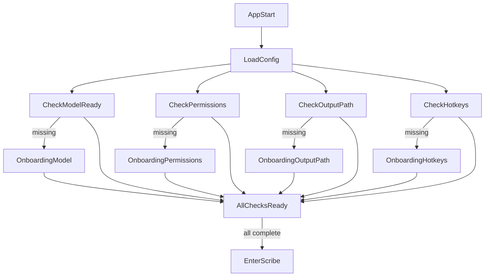

# Productionize Scribe + Settings + Onboarding (MMP)

## Outcomes
- First-run onboarding is complete for desktop: model setup, permissions, output path, hotkeys.
- Scribe can run package-ready with persistent settings and no repeated setup loops.
- Code aligns with architecture boundaries in `CLAUDE.md` (commands thin, controllers orchestrate, services own domain logic, platform-specific logic isolated).
- Test coverage and smoke checks act as release gates.
- MMP scope is explicitly single-source capture only; dual-source onboarding/dependency setup is deferred to a follow-up slice.

## Current Gaps (confirmed)
- Active flow exists mostly in [`/Users/benjamin/repos/liscribe_v8/src/lib/screens/scribe.svelte`](/Users/benjamin/repos/liscribe_v8/src/lib/screens/scribe.svelte); onboarding/settings are largely placeholders in:
  - [`/Users/benjamin/repos/liscribe_v8/src/lib/screens/setting_permissions.svelte`](/Users/benjamin/repos/liscribe_v8/src/lib/screens/setting_permissions.svelte)
  - [`/Users/benjamin/repos/liscribe_v8/src/lib/screens/setting_general.svelte`](/Users/benjamin/repos/liscribe_v8/src/lib/screens/setting_general.svelte)
- No permission/hotkey backend services yet.
- Dual-source capture prerequisites (BlackHole on macOS / WASAPI loopback guidance on Windows) are not currently represented in onboarding.
- Architectural strictness issues to fix while productizing:
  - `ScribeController::start` side-effects before state guard in [`/Users/benjamin/repos/liscribe_v8/src-tauri/src/controllers/scribe.rs`](/Users/benjamin/repos/liscribe_v8/src-tauri/src/controllers/scribe.rs)
  - business logic in command layer (`model_list`) in [`/Users/benjamin/repos/liscribe_v8/src-tauri/src/commands/model.rs`](/Users/benjamin/repos/liscribe_v8/src-tauri/src/commands/model.rs)
  - legacy/dead model command surface still registered in [`/Users/benjamin/repos/liscribe_v8/src-tauri/src/lib.rs`](/Users/benjamin/repos/liscribe_v8/src-tauri/src/lib.rs)

## Scope Guard (MMP)
- **In scope now:** single-source capture onboarding and production hardening.
- **Out of scope for this slice:** dual-source onboarding steps for BlackHole/WASAPI setup and validation.
- **Follow-up slice trigger:** re-open dual-source onboarding only when capture-device setup UX and platform checks are explicitly prioritized.

## Implementation Plan

### 1) Enforce architecture guardrails first (stabilization refactor)
- 1a. Fix `ScribeController::start` to validate state before creating session dirs/opening mic.
- 1b. Move model-selection projection/business logic from command layer into service/controller API.
- 1c. Remove redundant legacy command endpoints not used by UI.
- Keep command handlers as strict IPC adapters and gate each subtask independently.

### 2) Build onboarding state machine (frontend + backend contract)
- Add an onboarding orchestrator in frontend (route-level gate) to sequence:
  1. model setup,
  2. permission checks,
  3. output path confirmation,
  4. hotkey setup,
  5. done → enter Scribe.
- Mount onboarding from [`/Users/benjamin/repos/liscribe_v8/src/routes/+page.svelte`](/Users/benjamin/repos/liscribe_v8/src/routes/+page.svelte) and keep model modal behavior compatible.
- Explicit dependency note: implement against real APIs from Steps 3/4/5; if a UI shell is started earlier, it must use temporary stubs with the same contract shape and be replaced before completion.

### 3) Implement permissions capability (platform-aware)
- Add backend permission service and commands (status + request/open settings actions).
- Isolate OS specifics in a platform layer and keep controllers/services platform-agnostic.
- Wire `setting_permissions` UI to real command responses and step completion criteria.
- Done when:
  - permission status/request commands exist and are callable from UI,
  - permission state persists/reflects correctly in config or runtime state source,
  - onboarding + settings permission UI renders live status/actions without command errors.

### 4) Implement output-path settings and persistence
- Add command API to read/update settings with validation (path exists/creatable).
- Wire [`/Users/benjamin/repos/liscribe_v8/src/lib/components/form/PathSelectorField.svelte`](/Users/benjamin/repos/liscribe_v8/src/lib/components/form/PathSelectorField.svelte) and settings screen to persisted config.
- Ensure onboarding step completion requires a valid writable path.
- Done when:
  - output path read/update commands exist with validation failures surfaced as typed errors,
  - output path persists in config and reloads on restart,
  - onboarding + settings path selectors are wired to real commands without runtime errors.

### 5) Implement hotkey setup and persistence
- Add hotkey service/commands for assign, validate, and persist user hotkeys.
- Integrate with onboarding + settings UI (display current bindings, recapture flow, conflict handling).
- Ensure startup re-registers persisted hotkeys safely.
- Done when:
  - assign/validate/register commands exist and reject invalid/conflicting bindings,
  - hotkey config persists and rehydrates on startup,
  - onboarding + settings hotkey UI is fully wired and command invocations complete without errors.

### 6) Production hardening + explicit behavior test gates (TDD target)
- Core stability tests:
  - config persistence/migration defaults,
  - controller state transitions,
  - model selection/path resolution,
  - onboarding completion predicates.
- Explicit behavior gates (must pass before release):
  - speaker mode check is limited to single-source-slice expectations (UI toggle visibility/disabled state only; no dual-source capture assertion),
  - mic switching updates active input cleanly without stale device state,
  - waveform visualization remains linked to active audio stream data,
  - transcription progress bar reflects running/progress/completion transitions,
  - recorded audio path produces real transcript output in UI (not just state transitions),
  - model download/install path completes and selected model is actually used for transcription,
  - configurable input labels (in/out) update and persist as expected,
  - timestamp toggle reliably turns timestamp rendering on/off.
- Define release gate checklist: `cargo test`, compile checks, and UI smoke flow (first run + returning run + model-ready run).

### 6a) Arch task acceptance gates (review checklist)
- `arch-scribe-state-guard`
  - start-state validation occurs before side effects,
  - rejected start performs no session/audio setup side effects,
  - regression test covers invalid-state path.
- `arch-model-list-boundary`
  - command layer remains translation-only,
  - model list business logic resides in controller/service,
  - unit tests target the moved logic at controller/service level.
- `arch-dead-command-removal`
  - legacy command surface usage audit is documented,
  - unused registrations/handlers are removed,
  - app build + model workflows pass smoke verification.

### 7) Packaging readiness checks (macOS + Windows)
- Validate app behavior in packaged mode assumptions (paths, permission prompts, hotkey registration, first-run flow).
- Verify defaults and migration behavior with empty/old config files.
- Confirm no onboarding regressions when models are already present.

## Execution Order + Dependencies
- Arch stabilization (Step 1) is the first gate and must be complete before new onboarding/backend features.
- Backend contracts (Steps 3/4/5) are required for full onboarding integration (Step 2).
- Step 2 can start with a UI shell only if command contracts are defined up front and stubbed shapes match final APIs.
- Behavior tests (Step 6) and packaging checks (Step 7) are release gates after feature wiring is complete.

## Flow Target

