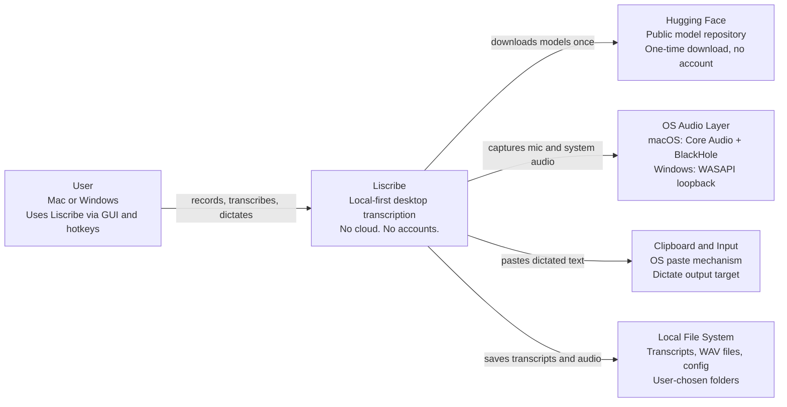
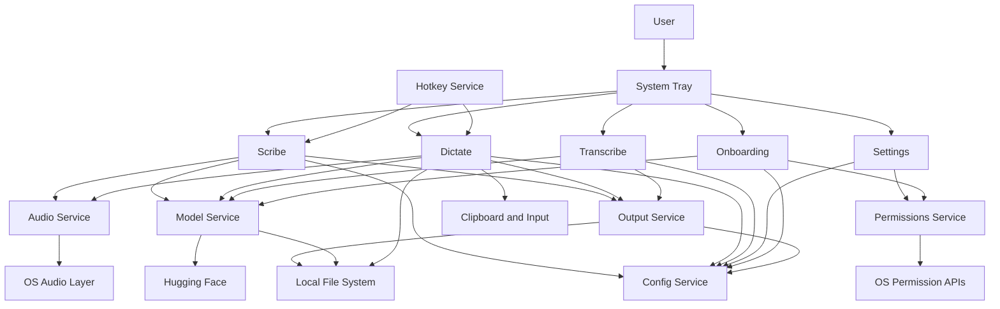
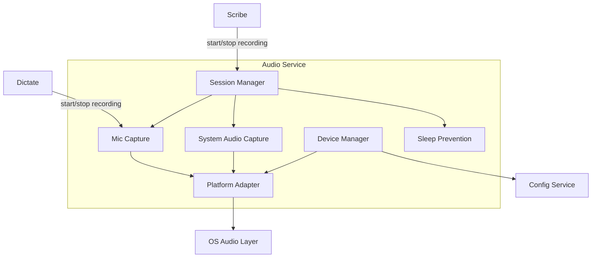
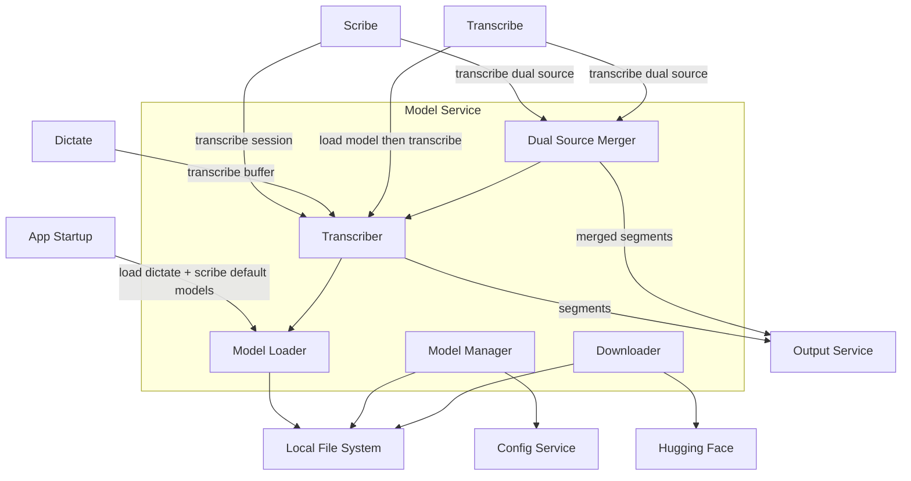
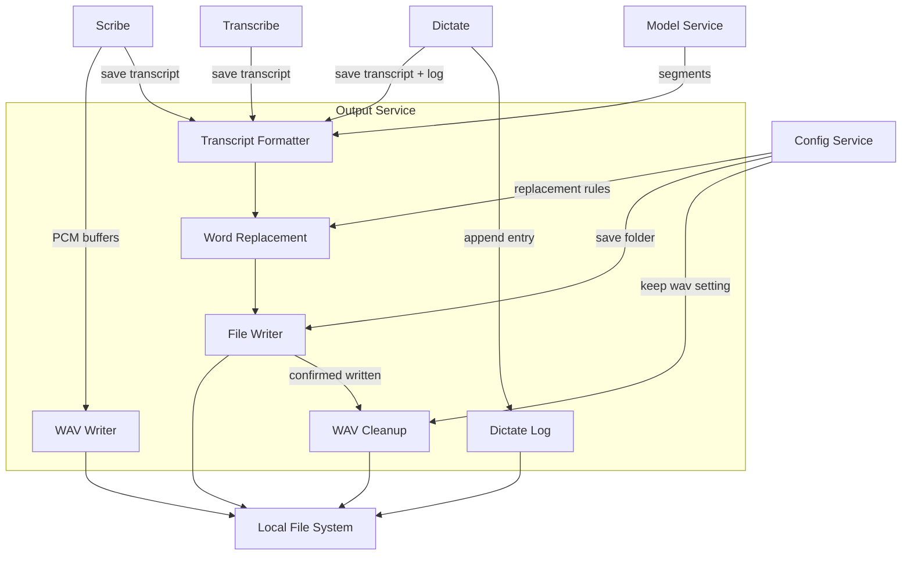
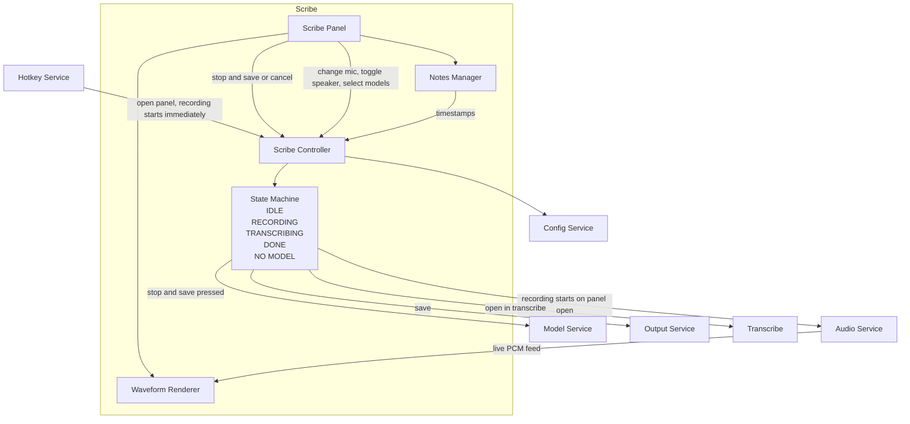
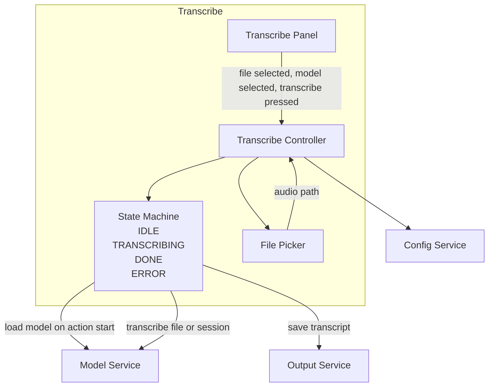
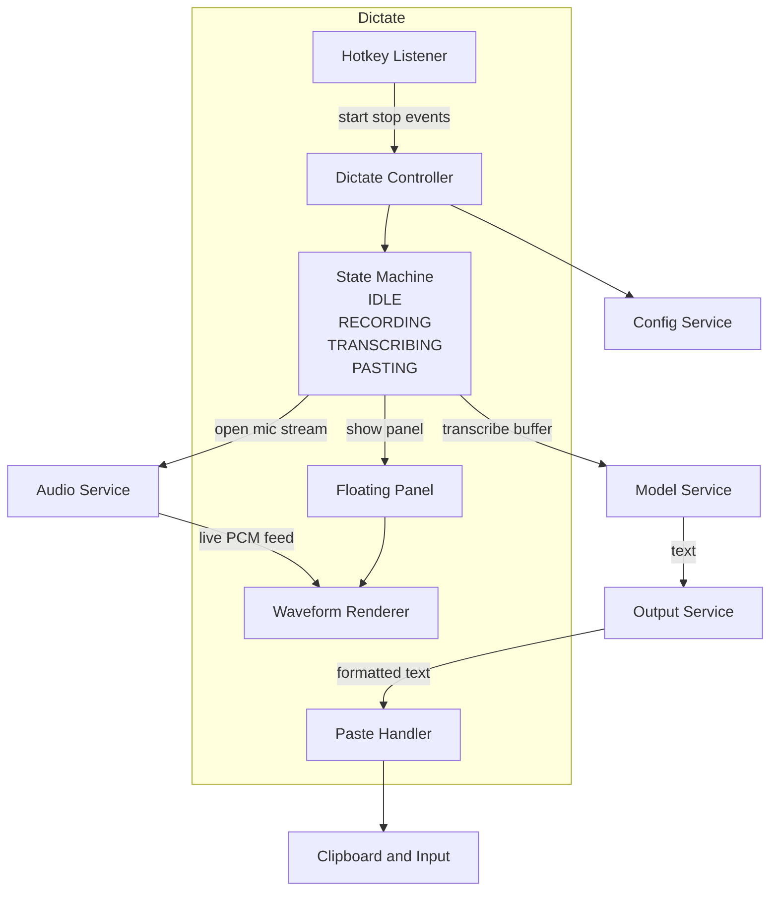
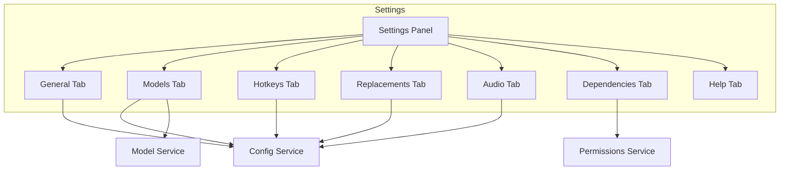
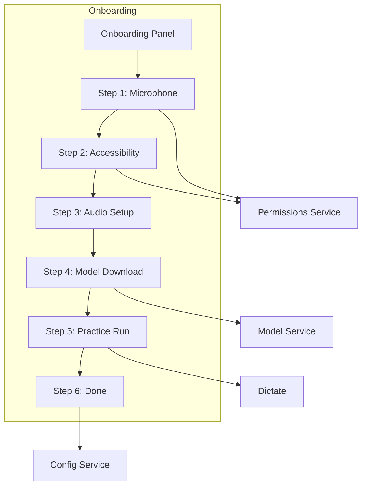

# Liscribe — Architecture

> C4 model: Context, Container, Component levels.
> All diagrams in Mermaid — agent and human readable.
> Platform adapter convention and permissions service defined at end.

---

## Level 1 — System Context

Who uses the system and what external systems it touches.



---

## Level 2 — Containers

All internal containers and how they connect.



---

## Level 3 — Components

### Audio Service

Capture only. Returns raw PCM buffers. Never writes to disk.



**Component notes:**
- Device Manager: lists inputs, detects preferred mic, falls back to system default
- Mic Capture: opens mic stream, buffers raw PCM chunks
- System Audio Capture: macOS = BlackHole via Core Audio, Windows = WASAPI loopback
- Session Manager: coordinates both streams, tracks speaker offset, returns dual buffers
- Sleep Prevention: macOS = IOPMAssertionCreateWithName, Windows = SetThreadExecutionState. Acquired on stream open, released on close
- Platform Adapter: single point of OS divergence. Everything above is platform-agnostic

---

### Model Service

Download, load, transcribe, merge.



**Component notes:**
- Model Manager: lists models, tracks downloaded status, reports file size
- Downloader: fetches `ggml-*.bin` from Hugging Face, streams to disk (progress UI TBD)
- Model Loader: loads ggml into memory, caches one `WhisperContext` per model id
- Transcriber: runs whisper-rs inference, returns timestamped segments, reports 0-100% progress
- Dual Source Merger: merges mic and speaker segments chronologically, suppresses mic bleed, applies in:/out: labels

**Loading strategy — no magic, no heuristics:**
- Dictate default model → loaded at app startup
- Scribe default model → loaded at app startup (likely same model as Dictate, shared cache)
- Transcribe default model → loaded when Transcribe action starts
- Extra models selected in Scribe panel → loaded when transcription starts after Stop and Save
- Loaded models cached for app session — no reload cost for consecutive uses

---

### Output Service

All file writes. Nothing else writes to disk.



**Component notes:**
- WAV Writer: writes mic.wav, speaker.wav from PCM buffers, writes session.json
- Transcript Formatter: builds markdown from segments. Single source = timestamped lines. Dual source = in:/out: labelled lines merged chronologically
- Word Replacement: applies find/replace rules. Scope per rule: transcripts, dictate, or both
- File Writer: writes markdown to save folder, verifies file written and non-empty, sets permissions
- WAV Cleanup: deletes mic.wav, speaker.wav, session.json — only after transcript verified. Skipped if keep setting on. Skipped if no model was available at record time
- Dictate Log: appends to dictate.jsonl. Records date, time, text. Skips empty transcripts

---

### Scribe

Recording starts immediately on panel open. No explicit start button.



**State transitions:**
- IDLE → RECORDING: panel opens (hotkey or tray)
- RECORDING → TRANSCRIBING: Stop and Save pressed
- RECORDING → IDLE: Cancel pressed
- TRANSCRIBING → DONE: transcript written
- TRANSCRIBING → NO MODEL: no model downloaded at record time

---

### Transcribe

User brings existing audio. No recording step.



**Component notes:**
- File Picker: accepts WAV, MP3, M4A, FLAC. Detects dual-source session folder (contains mic.wav + session.json). Pre-fills path if opened via Open in Transcribe from Scribe

---

### Dictate

Always listening. Hotkey-driven. Audio in memory only — never written to disk.



**Component notes:**
- Hotkey Listener: detects double-tap and hold/release. Fires start/stop events to controller
- Floating Panel: appears near cursor, does not steal focus, shows waveform and timer only
- Paste Handler: uses Platform Adapter. macOS = Accessibility API paste. Windows = SendInput. Fallback = clipboard + system notification
- Audio buffer: memory only. No WAV written to disk under any circumstance

---

### Settings



**Tab contents:**
- General: save folder, default mic, WAV retention, auto-enter, open transcripts with, start on login
- Models: per-action default model (Dictate / Scribe / Transcribe), download and delete models
- Hotkeys: Scribe hotkey, Dictate trigger key and mode. Save and restart to apply
- Replacements: add/edit/delete rules, scope per rule
- Audio: macOS = BlackHole status and setup guide. Windows = WASAPI device selector. Mic and speaker labels
- Dependencies: live permission status, one-tap path to OS settings pane
- Help: inline topics, no network required

---

### Onboarding

First-launch wizard. Blocks app until complete. Replayable from Settings → Help.



**Step notes:**
- Step 1: request mic permission, verify granted before continuing
- Step 2: macOS = request Accessibility permission. Windows = skip
- Step 3: macOS = BlackHole install walkthrough. Windows = WASAPI confirmation
- Step 4: user picks model per action (Dictate / Scribe / Transcribe), download with progress
- Step 5: live Dictate practice test, user speaks and sees paste result
- Step 6: mark onboarding complete in config, app unlocked

---

## Architectural conventions

### Platform Adapter pattern

Any component with OS-specific behaviour isolates that behaviour behind a Platform Adapter.
Everything above the adapter is platform-agnostic. `#[cfg(target_os)]` checks belong only inside adapter implementations — never in controllers or panels.

Components requiring a Platform Adapter:
- Audio Service → system audio capture (BlackHole vs WASAPI)
- Dictate Paste Handler → paste mechanism (Accessibility API vs SendInput)
- Permissions Service → permission checks and OS settings deep-links

```rust
trait PlatformAdapter {
    fn capture_system_audio(&self) -> AudioStream;
}

#[cfg(target_os = "macos")]
struct MacOSAdapter;

#[cfg(target_os = "windows")]
struct WindowsAdapter;
```

### Call chain

```
panel (Svelte)
  → command (Tauri IPC — translation only)
    → controller (orchestration, owns state machine)
      → service (Audio, Model, Output, Config, Hotkey, Permissions)
        → engine (Recorder, Transcriber, Output builder — frozen once stable)
```

IPC: JS calls `invoke('command_name', { args })` → Rust `#[tauri::command]` in `commands/` → controller → service.

### Separation of concerns — hard rules

- Engine files are frozen once stable. Bugs get a `// BUG:` comment, not an in-place fix
- Services are singletons instantiated at app startup and passed down. Never instantiated inside controllers
- Controllers never import engine files directly — always through a service
- Output Service is the only component that writes to disk
- Audio Service is the only component that opens audio streams
- Permissions Service is the only component that checks OS permission state
