# scribefloat — Architecture

> C4 model: Context, Container, Component, Code levels.
> All diagrams in Mermaid — agent and human readable.
> Platform adapter convention and permissions service defined at end.

---

## Level 1 — System Context

Who uses the system and what external systems it touches.

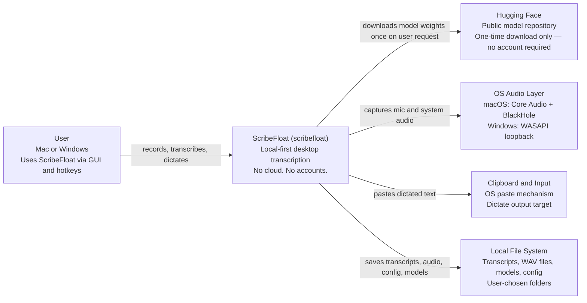

**External system notes:**

- **Hugging Face**: contacted only when the user clicks "Download model" in Settings. A single HTTPS GET for the model binary. No user data is sent. No account required.
- **OS Audio Layer**: cpal abstracts platform differences. Controllers never touch the audio layer directly — only `AudioService` does.
- **Clipboard and Input**: Dictate writes to the clipboard as fallback, or uses OS input injection (macOS: Accessibility API, Windows: SendInput). Scribe and Transcribe do not touch the clipboard.
- **Local File System**: the structured record store (`history.jsonl`) goes through `HistoryService`. Markdown rendering and durable file I/O (transcripts, manifests, cleanup, dictate failure salvage, legacy reads) go through `OutputService`. Capture-time WAV streaming (checkpointed every 30 s) is handled by `AudioService`'s writer thread. Config and models go through `ConfigService`.

---

## Level 2 — Containers

All internal containers and their connections. Shows actual Rust modules and Svelte screens as they exist in the codebase.

```mermaid
graph TB
    user["User"]

    subgraph frontend["Frontend (SvelteKit / TypeScript)"]
        tray["System Tray\nlib.rs — TrayIconBuilder"]
        scribe_ui["Scribe Screen\nscribe.svelte\nscribe-processing.svelte"]
        transcribe_ui["Transcribe Screen\ntranscribe.svelte"]
        dictate_ui["Dictate HUD\ndictate.svelte"]
        history_ui["History\nhistory.svelte"]
        settings_ui["Settings\nsettings.svelte\nsetting_*.svelte"]
    end

    subgraph commands["Commands Layer (Tauri IPC — translation only)"]
        cmd_scribe["commands/scribe.rs"]
        cmd_transcribe["commands/transcribe.rs"]
        cmd_dictate["commands/dictate.rs"]
        cmd_history["commands/history.rs"]
        cmd_model["commands/model.rs"]
        cmd_settings["commands/settings.rs"]
    end

    subgraph controllers["Controllers (state machines, orchestration)"]
        ctrl_scribe["ScribeController\ncontrollers/scribe.rs"]
        ctrl_transcribe["TranscribeController\ncontrollers/transcribe.rs"]
        ctrl_dictate["DictateController\ncontrollers/dictate.rs"]
        ctrl_history["HistoryController\ncontrollers/history.rs"]
        ctrl_model["ModelController\ncontrollers/model.rs"]
        ctrl_settings["SettingsController\ncontrollers/settings.rs"]
    end

    subgraph services["Services (singletons, created once in lib.rs)"]
        svc_audio["AudioService\nservices/audio.rs"]
        svc_model["ModelService\nservices/model.rs"]
        svc_output["OutputService\nservices/output.rs"]
        svc_history["HistoryService\nservices/history.rs"]
        svc_config["ConfigService\nservices/config.rs"]
        svc_hotkeys["HotkeyService\nservices/hotkeys.rs"]
        svc_permissions["PermissionsService\nservices/permissions.rs"]
        svc_transcribe_input["TranscribeInputService\nservices/transcribe_input.rs"]
    end

    subgraph platform["Platform Adapters (OS-specific only)"]
        plat_audio["Audio (BlackHole / WASAPI)\nplatform/mod.rs"]
        plat_paste["Paste (Accessibility API / SendInput)\nplatform/paste_impl.rs"]
        plat_permissions["Permissions (macOS / Windows)\nplatform/permissions_impl.rs"]
        plat_key["Key Listener (CGEventTap / win32)\nplatform/key_listener.rs"]
        plat_window["Window ops\nplatform/window_impl.rs"]
    end

    subgraph external["External"]
        fs["Local File System"]
        hf["Hugging Face"]
        os_audio["OS Audio Layer"]
        os_clipboard["Clipboard and Input"]
        os_permissions["OS Permission APIs"]
    end

    user --> tray
    tray --> scribe_ui
    tray --> transcribe_ui
    tray --> dictate_ui
    tray --> history_ui
    tray --> settings_ui

    scribe_ui -->|"invoke()"| cmd_scribe
    transcribe_ui -->|"invoke()"| cmd_transcribe
    dictate_ui -->|"invoke()"| cmd_dictate
    history_ui -->|"invoke()"| cmd_history
    history_ui -->|"invoke()"| cmd_settings
    settings_ui -->|"invoke()"| cmd_model
    settings_ui -->|"invoke()"| cmd_settings

    cmd_scribe --> ctrl_scribe
    cmd_transcribe --> ctrl_transcribe
    cmd_dictate --> ctrl_dictate
    cmd_history --> ctrl_history
    cmd_model --> ctrl_model
    cmd_settings --> ctrl_settings

    ctrl_scribe --> svc_audio
    ctrl_scribe --> svc_model
    ctrl_scribe --> svc_output
    ctrl_scribe --> svc_history
    ctrl_scribe --> svc_config

    ctrl_transcribe --> svc_model
    ctrl_transcribe --> svc_output
    ctrl_transcribe --> svc_history
    ctrl_transcribe --> svc_config
    ctrl_transcribe --> svc_transcribe_input

    ctrl_dictate --> svc_audio
    ctrl_dictate --> svc_model
    ctrl_dictate --> svc_output
    ctrl_dictate --> svc_history
    ctrl_dictate --> svc_config
    ctrl_dictate --> plat_paste
    ctrl_dictate --> plat_key

    ctrl_history --> svc_history
    ctrl_history --> svc_output
    ctrl_history --> svc_config

    ctrl_model --> svc_model
    ctrl_model --> svc_config

    ctrl_settings --> svc_config
    ctrl_settings --> svc_permissions

    svc_hotkeys --> ctrl_dictate
    svc_hotkeys --> ctrl_scribe

    svc_audio --> plat_audio
    svc_permissions --> plat_permissions
    plat_paste --> os_clipboard
    plat_key --> os_clipboard
    plat_audio --> os_audio
    plat_permissions --> os_permissions

    svc_output --> fs
    svc_history --> fs
    svc_config --> fs
    svc_model --> fs
    svc_model --> hf
    svc_transcribe_input --> fs
```

---

## Level 3 — Components

### Audio Service

Opens audio streams and streams capture to 16 kHz mono WAV on disk via a dedicated writer thread (checkpointed headers every 30 s). Controllers read WAVs back for Whisper — they do not accumulate PCM in RAM.

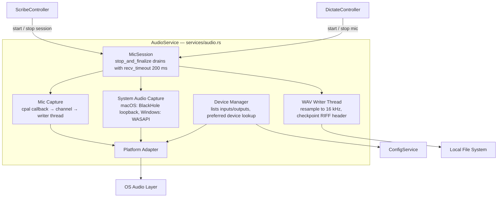

**Component notes:**
- **Device Manager**: lists inputs and outputs, resolves preferred device by name, falls back to system default
- **Mic Capture**: cpal callback mixes to mono and pushes chunks into a channel; no disk I/O on the callback thread
- **System Audio Capture**: macOS = BlackHole virtual device via Core Audio; Windows = WASAPI loopback. Speaker capture requires BlackHole + a configured Multi-Output Device name on macOS
- **MicSession**: `stop_and_finalize()` pauses the stream, signals the writer, and joins the writer thread. Drain uses `recv_timeout` (200 ms) — never blocking `recv()` — because cpal tears down CoreAudio asynchronously on macOS
- **WAV Writer Thread**: resamples to 16 kHz mono i16 and appends to the target path (`mic.wav`, `speaker_seg_N.wav`, or dictate temp). Checkpoints the RIFF header periodically so crash mid-recording leaves a playable file
- **SpeakerAccumulator** (in `ScribeController`): holds `CapturedSpeakerSegment { start_ms, wav_path }` for each ON/OFF loopback window. At stop, segments are read back and assembled via `assemble_speaker_pcm`; per-segment WAVs are deleted after merge
- **Platform Adapter**: the only place `#[cfg(target_os)]` lives for audio. Everything above is platform-agnostic

---

### Model Service

Download, load, transcribe, merge.

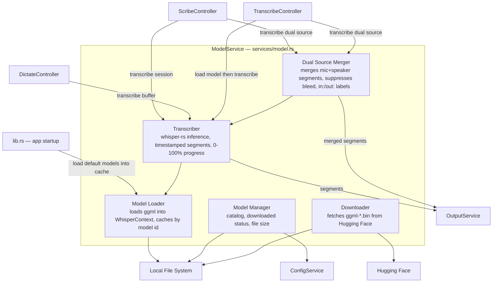

**Component notes:**
- **Model Manager**: lists models from a static catalog, checks for downloaded `.bin` file on disk, reports file size
- **Downloader**: fetches `ggml-*.bin` from Hugging Face over HTTPS, streams progress via `AppHandle::emit`. _See fix-later A1 — emit should be moved to `ModelController`._
- **Model Loader**: loads ggml weights into a `WhisperContext` via whisper-rs, caches one context per model ID for the app session
- **Transcriber**: runs Whisper inference inside `tokio::task::spawn_blocking`. Calls `on_tick` per segment to report progress. Use `eprintln!` / `std::time::Instant` for timing — tracing spans do not propagate into blocking threads
- **Dual Source Merger**: sorts mic and speaker segments chronologically by timestamp; suppresses near-duplicate lines within 1.5 s (mic bleed); applies `in:`/`out:` labels. Before merging, speaker segments are filtered by `filter_hallucination_phrases` — segments matching known Whisper hallucination phrases ("Thank you.", "Thanks for watching.", etc.) are stripped. Upstream, `ScribeController` also applies an RMS silence gate: if the assembled speaker PCM has RMS < −60 dBFS (1e-3), the speaker channel is skipped entirely and the session is treated as single-source

**Loading strategy:**
- Whisper contexts cached in `ModelService` keyed by model path (`get_or_load_context`) — eliminates cold-load on every transcribe
- Tiny/base models preloaded in background when a Scribe or Dictate recording starts (`PRELOAD_ELIGIBLE_MODEL_IDS` in `services/model.rs`)
- Transcribe model → loaded when a Transcribe job starts
- Inference thread count capped at physical cores (max 8)

---

### TranscribeInput Service

Decode and expand audio inputs for the Transcribe feature.

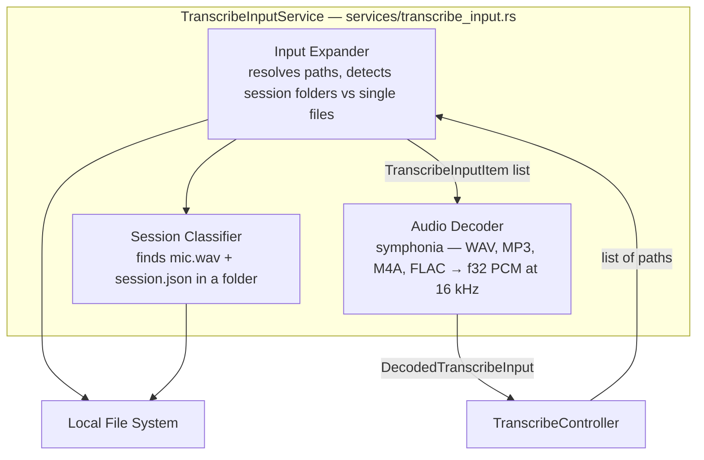

**Component notes:**
- **Input Expander**: resolves raw path strings, deduplicates, detects whether a path is a session directory (contains `mic.wav` + `session.json`) or a single audio file
- **Session Classifier**: identifies dual-source session directories and extracts `mic_path` + optional `speaker_path`
- **Audio Decoder**: uses Symphonia to decode WAV, MP3, M4A, and FLAC to mono f32 PCM, then resamples to 16 kHz using `resample_linear`

---

### History Service

Owns the structured record store at `{save_folder}/history.jsonl` — an append-only, one-compact-JSON-object-per-line log. Every transcript-bearing flow (Scribe, Dictate, Transcribe) appends a record here on completion. Updates (`set_markdown_path`) and deletes (tombstone `deleted = true`) also append a new line for the same id; the loader does last-writer-wins by id. Startup `compact()` rewrites the live set atomically (temp file + rename). Mirrors `OutputService`'s stateless-with-folder style: save_folder is passed per call and the cache reloads when the folder changes.

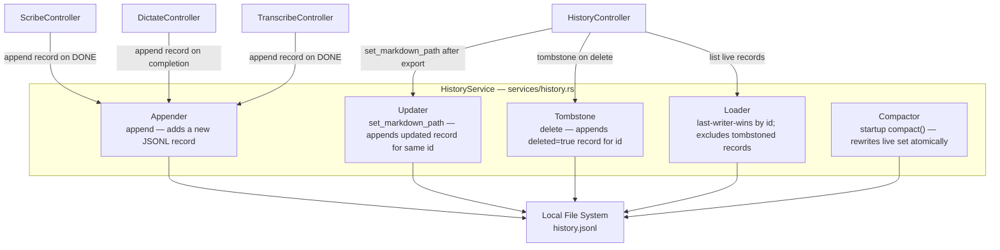

**Component notes:**
- **Appender**: appends a new JSON object line to `history.jsonl` for a completed session. Called by ScribeController, DictateController, and TranscribeController on every successful completion — independent of whether a `.md` file was written
- **Updater**: `set_markdown_path` appends a new line for an existing id (sets the `markdown_path` field). The loader's last-writer-wins semantics mean the updated record supersedes the original
- **Tombstone**: `delete` appends a line with `deleted = true` for the id. The loader excludes tombstoned records from the live set
- **Loader**: reads all lines, groups by id, and returns the last-written record per id, excluding any with `deleted = true`
- **Compactor**: `compact()` runs at startup — rewrites only the live (non-tombstoned) records to a temp file, then renames it over `history.jsonl`. Keeps the file from growing unboundedly

---

### Output Service

Markdown rendering (pure) and durable file I/O: `.md` writes (opt-in, gated by `save_transcripts_as_markdown`), session manifests, post-transcription cleanup, dictate failure salvage, legacy reads (`list_transcripts`, `read_dictate_history`), and delete primitives (`delete_file`, `delete_wav`, `remove_session_dir`). Does not own the structured record store — that is `HistoryService`. Capture-time WAV streaming is owned by `AudioService`.

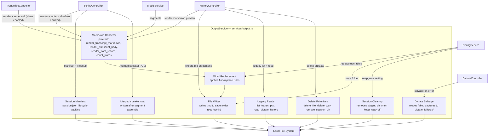

**Component notes:**
- **Markdown Renderer**: pure free functions (`render_transcript_markdown`, `render_transcript_body`, `render_from_record`, `count_words`). Builds Markdown from Whisper segments — no file I/O. `write_transcript` is a thin wrapper over `render_transcript_markdown`. Segments are grouped: consecutive same-source segments within an 8-second gap are merged into one paragraph. Dual-source speaker-change boundaries use `\n`; same-source paragraph breaks use `\n\n`
- **Transcript path**: `{save_folder}/{title}_{model}.md`; appends `_1`, `_2`, … before `.md` when the base name already exists. WAV staging lives in `{save_folder}/{timestamp}/`. `.md` is written only when `save_transcripts_as_markdown` is on (default off); Dictate never writes `.md`
- **Word Replacement**: applies user-defined find/replace rules. Scope per rule: transcripts, dictate, or both
- **Session Manifest**: `session.json` tracks recording lifecycle (`recording`, `transcribing`, `complete`, `error`, `interrupted`) for crash recovery. Scribe UI polls `scribe_list_recovery_sessions` on open
- **WAV Cleanup**: when `keep_wav = false`, deletes staging WAVs and removes the session directory after a successful transcript. Transcript `.md` (if written) stays at save folder root
- **Dictate Salvage**: on transcription failure, moves the temp WAV from `dictate_temp/` to `{save_folder}/dictate_failures/`
- **Legacy Reads**: `list_transcripts` enumerates existing `.md` files in the save folder; `read_dictate_history` reads the legacy `dictate_history.json` file. Both are read-only — used by `HistoryController` to merge with the structured record store
- **Delete Primitives**: `delete_file`, `delete_wav`, `remove_session_dir` — called by `HistoryController` when deleting a store record's artifacts (boundary-checked)

---

### Scribe

Recording starts immediately on panel open. No explicit start button.

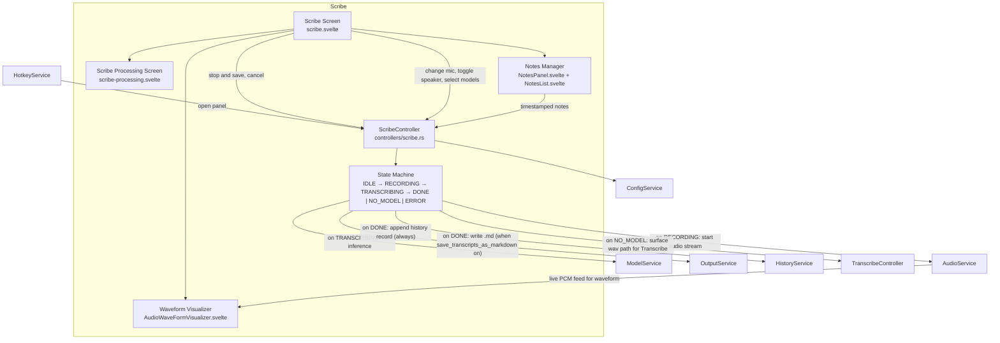

**State transitions:**
- `IDLE → RECORDING`: user presses **Start Recording** in panel (hotkey `CmdOrCtrl+Shift+L` or tray click opens the panel; recording does not start automatically)
- `RECORDING → TRANSCRIBING`: Stop & Save pressed
- `RECORDING → IDLE`: Cancel pressed — audio discarded
- `TRANSCRIBING → DONE`: history record appended; `.md` written if `save_transcripts_as_markdown` is on
- `TRANSCRIBING → NO_MODEL`: no model configured at record time — WAV preserved, "Open in Transcribe" shown
- `TRANSCRIBING → ERROR`: unexpected failure

---

### Transcribe

User supplies an existing audio file. No recording step.

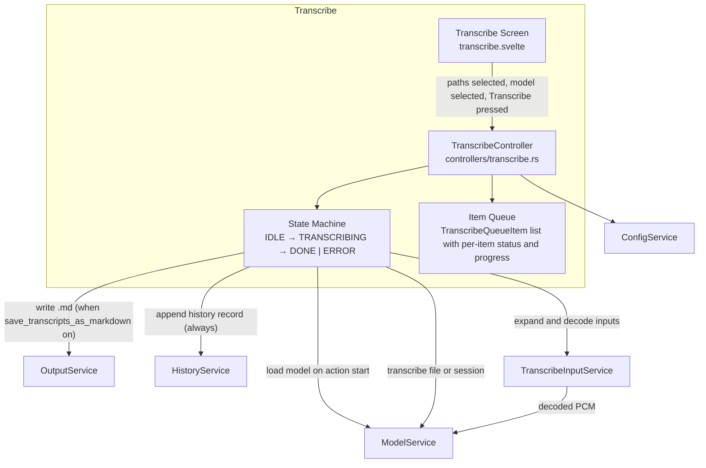

**Component notes:**
- **Queue**: supports multiple items; each item tracks `Queued → Processing → Done | Error` with per-item progress
- **TranscribeInputService**: accepts WAV, MP3, M4A, FLAC. Detects dual-source session directory (contains `mic.wav` + `session.json`). Decodes to 16 kHz mono f32 PCM for Whisper. Pre-fills path if opened via "Open in Transcribe" from a Scribe NO_MODEL result

---

### Dictate

Always listening. Hotkey-driven. Audio lives in RAM only — never written to disk.

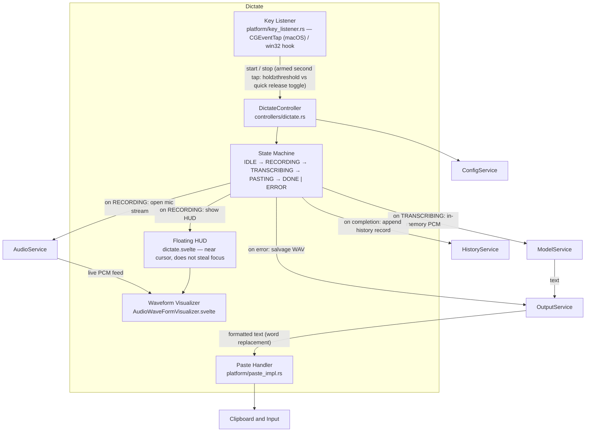

**Component notes:**
- **Key Listener**: macOS uses `CGEventTap` reading raw keycodes — does not call `TSMGetInputSourceProperty`, safe on macOS 13+. Windows uses a system keyboard hook. `rdev::listen` must NOT be used on macOS (crashes on 13+ due to `TSMGetInputSourceProperty` assertion on non-main thread)
- **Floating HUD**: appears near cursor. Never calls `set_focus()` — the app may be in `.accessory` activation policy and `set_focus()` would kill the process in that state
- **Paste Handler**: macOS = Accessibility API (`enigo` Cmd+V simulation). Windows = `SendInput`. Fallback = clipboard write + system notification. HUD is hidden before paste, with ~150 ms sleep to let the OS restore focus to the target app. Clipboard contents are verified unchanged immediately before the keypress fires — if another process modified the clipboard during the sleep window, paste is aborted and `paste_failed` is set
- **Audio buffer**: PCM lives in memory only during dictation. There is no staging WAV file for dictate. On success the temp WAV (written by AudioService under `dictate_temp/`) is deleted; on failure OutputService salvages it to `dictate_failures/`. Dictate never writes a `.md` file

---

### Settings

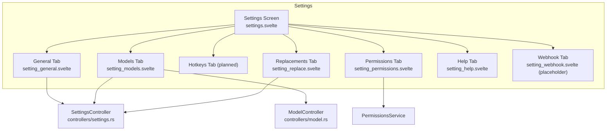

**Tab contents:**
- **General**: save folder, default mic, WAV retention, auto-enter, open-transcripts-with app, start on login
- **Models**: per-action default model (Dictate / Scribe / Transcribe), download and delete; download progress shown via `model://download-progress` event
- **Hotkeys**: Scribe hotkey, Dictate trigger key and mode — currently shown in General; dedicated tab planned
- **Replacements**: add/edit/delete rules, scope per rule (transcripts / dictate / both). Default rules use a `float` prefix (e.g. "float dash" → `-`) so normal speech does not accidentally trigger replacements
- **Permissions**: live permission status via `PermissionsService`; one-tap path to OS settings pane
- **Help**: inline topics; no network required
- **Webhook**: placeholder screen — feature not yet implemented in backend

---

## Architectural conventions

### Platform Adapter pattern

Any component with OS-specific behaviour isolates that behaviour behind a Platform Adapter.
Everything above the adapter is platform-agnostic. `#[cfg(target_os)]` checks belong only inside adapter implementations — never in controllers, services, or panels.

Components requiring a Platform Adapter:

| Component | macOS | Windows |
|-----------|-------|---------|
| System audio capture | BlackHole via Core Audio — auto-detected by name if no device explicitly configured | WASAPI loopback |
| Dictate paste | `enigo` via Accessibility API | `SendInput` |
| Permissions check | `AVCaptureDevice`, `AXIsProcessTrusted`, tcc.db | Registry (HKCU\...\Microphone) |
| Key listener | `CGEventTap` | win32 keyboard hook |
| Window activation | `setActivationPolicy` (NSApp) | n/a |

```rust
// Trait defined in platform/mod.rs
trait PlatformAdapter {
    fn capture_system_audio(&self) -> AudioStream;
}

#[cfg(target_os = "macos")]
struct MacOSAdapter;

#[cfg(target_os = "windows")]
struct WindowsAdapter;
```

### Call chain

```
panel (Svelte / TypeScript)
  → command (Tauri IPC — JS type → Rust type, one controller call, nothing else)
    → controller (owns Arc<Mutex<Inner>> state machine, orchestrates services)
      → service (stateless or singleton, created once in lib.rs::run())
        → platform (OS-specific, behind #[cfg(target_os)])
```

IPC: JS calls `invoke('command_name', { args })` → Rust `#[tauri::command]` in `commands/` → controller → service.

### Separation of concerns — hard rules

| Rule | Enforcement |
|------|-------------|
| Commands do type translation only — no logic | Verified by code review; any business logic found here is a bug |
| Services are singletons created in `lib.rs` | Never instantiate a service inside a controller |
| Controllers never import platform files directly | Controllers call services; services call platform adapters |
| `HistoryService` owns the structured record store | `{save_folder}/history.jsonl` — append, compact, tombstone delete; every transcript-bearing flow always appends here |
| `OutputService` owns markdown rendering and durable file I/O | Pure markdown renderers, `.md` writes (opt-in via `save_transcripts_as_markdown`), manifests, cleanup, failure salvage, legacy reads, delete primitives; Dictate never writes `.md` |
| `AudioService` streams capture to checkpointed WAV files | All live capture writes during recording; 16 kHz writer thread in `services/audio.rs` |
| `PermissionsService` is the only code that checks OS permission state | All permission queries in `services/permissions.rs` |
| `#[cfg(target_os)]` belongs only in `platform/` | Checked by code review and `cargo check --target` for both platforms |
| Engine files are frozen once stable | Bugs get a `// BUG:` comment, not an in-place fix without full understanding |

### State machine pattern

Each controller owns an `Arc<Mutex<Inner>>`. Methods lock, check state, act, and release. Never hold a lock across a blocking call (Whisper inference, file I/O).

```
ScribeController:    IDLE → RECORDING → TRANSCRIBING → DONE | NO_MODEL | ERROR
DictateController:   IDLE → RECORDING → TRANSCRIBING → PASTING → DONE | ERROR
TranscribeController: IDLE → TRANSCRIBING → DONE | ERROR
```

---

## Level 4 — Code (key module map)

```
src-tauri/src/
├── lib.rs                      App entry: service init, tray, window management, hotkeys
├── main.rs                     Tauri bootstrap (calls lib::run)
├── types.rs                    All shared types: Config, state enums, event payloads, Segment
│
├── commands/
│   ├── mod.rs                  generate_handler![] macro registration
│   ├── scribe.rs               scribe_start, scribe_stop, scribe_cancel, scribe_state
│   ├── transcribe.rs           transcribe_add, transcribe_start, transcribe_cancel
│   ├── dictate.rs              dictate_start, dictate_stop
│   ├── history.rs              history_list, history_get_detail, history_render_markdown, history_export_markdown, history_delete, history_read_legacy
│   ├── model.rs                model_list, model_download, model_delete, model_select
│   └── settings.rs             config_get, config_update, permissions_status, open_settings, settings_get/set_save_transcripts_as_markdown
│
├── controllers/
│   ├── mod.rs
│   ├── scribe.rs               ScribeController — Arc<Mutex<ScribeInner>>
│   ├── transcribe.rs           TranscribeController — Arc<Mutex<TranscribeInner>>
│   ├── dictate.rs              DictateController — Arc<Mutex<DictateInner>>
│   ├── history.rs              HistoryController — read/orchestration only (no state machine); merges store + legacy, dedupes, delete
│   ├── model.rs                ModelController — model list, download, delete
│   └── settings.rs             SettingsController — config read/write
│
├── services/
│   ├── mod.rs
│   ├── audio.rs                AudioService, MicSession, streaming WAV writer, read_wav_mono_f32
│   ├── model.rs                ModelService, WhisperContext cache, Downloader, Merger
│   ├── output.rs               OutputService, markdown rendering (pure), .md writes, manifest, cleanup, legacy reads, delete primitives
│   ├── history.rs              HistoryService, append-only JSONL record store, compact, tombstone delete
│   ├── config.rs               ConfigService, atomic save, get/update
│   ├── hotkeys.rs              HotkeyService, HotkeyRegistrar trait, TauriHotkeyRegistrar
│   ├── permissions.rs          PermissionsService (delegates to platform/permissions_impl)
│   └── transcribe_input.rs     TranscribeInputService, expand_inputs, decode_input
│
└── platform/
    ├── mod.rs                  Platform traits, sync_activation_policy
    ├── key_listener.rs         CGEventTap (macOS) / win32 hook — NO rdev on macOS
    ├── paste_impl.rs           enigo paste + enter (macOS) / SendInput (Windows)
    ├── permissions_impl.rs     Per-OS permission query and settings deep-link
    └── window_impl.rs          macOS activation policy helpers

src/
├── lib/
│   ├── components/             Reusable Svelte components
│   │   ├── audio/              AudioWaveFormVisualizer, RecordingStatusDot, RecordingTimer
│   │   ├── form/               DeviceSelect, ToggleSwitch, PathSelectorField, OptionGroup, …
│   │   ├── layout/             PanelShell, PanelHeader, PanelFooter, SplitPane, FixedFooterBar
│   │   ├── history/            HistoryListCard, HistoryDetailPane
│   │   ├── notes/              NotesPanel, NoteCard, NotesList, NoteComposer
│   │   └── transcribe/         TranscribeQueueList, TranscribeQueueRow
│   ├── screens/                Full panel screens
│   │   ├── scribe.svelte       Recording UI
│   │   ├── scribe-processing.svelte   Transcribing / Done / No-model UI
│   │   ├── transcribe.svelte   File import and queue UI
│   │   ├── dictate.svelte      Floating HUD
│   │   ├── history.svelte      Unified history (list mode + fullscreen detail)
│   │   ├── settings.svelte     Settings shell with tab routing
│   │   └── setting_*.svelte    Individual settings tabs
│   └── stores/
│       └── modelDownload.svelte.ts   Download progress store
└── routes/
    ├── +page.svelte            Root — selects panel based on window label
    └── +layout.svelte          Theme provider
```
