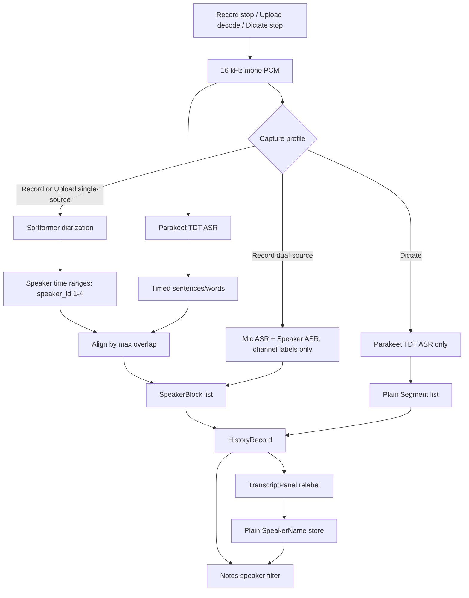

# Handoff Plan: Parakeet Offline Transcription, Diarization, And Plain Speaker Names

## Summary
Replace Whisper, Silero VAD, and biometric voiceprints with an offline Parakeet pipeline. Use **Parakeet TDT** for timestamped transcription and **Sortformer v2** through `parakeet-rs` for diarization. Keep live transcription out of scope. Convert the existing voiceprint profile store into a plain global speaker-name store by preserving only names/slugs.

Primary success criteria: Record, Upload, and Dictate still create notes; single-source Record/Upload can produce speaker-labelled transcript blocks; transcript speakers can be renamed to saved global names; Notes can filter by those names; no voiceprint enrollment, embeddings, or voice-learning UI remains.

Sources for implementation choices:
- `parakeet-rs` README: TDT, Sortformer, model files, 4-speaker Sortformer limit, and long-audio note: https://github.com/altunenes/parakeet-rs
- `parakeet-rs` docs/source: https://docs.rs/parakeet-rs/latest/parakeet_rs/

Implementation checkpoint added before the model swap: first deepen `src-tauri/src/services/transcription.rs` into the post-capture transcription seam while preserving current Whisper/Silero/voiceprint behavior. Record, Upload, and Dictate should consume one complete transcript result before Parakeet TDT + Sortformer replace the inference adapter behind that interface.

## Architecture Diagram

## Non-Negotiable Decisions
- Use `parakeet-rs = { version = "0.3.6", features = ["sortformer"] }`.
- Use **Parakeet TDT** as the v1 ASR model because it provides punctuation and sentence timestamps.
- Use **Sortformer v2** (`diar_streaming_sortformer_4spk-v2.onnx`) as the v1 diarization model because it matches the crate example. Do not use Multitalker in this refactor.
- Treat Sortformer as **maximum 4 speaker slots**. If more than 4 speakers are present, output is best-effort and may merge speakers.
- Keep all processing offline/post-capture. No partial/live transcript events.
- CPU-first. Do not add GPU/WebGPU unless a later task measures and validates it.

## Data Flow And Behavior
- Record single-source:
  - Capture mic PCM as today.
  - Run Sortformer on the full mic PCM.
  - Run Parakeet TDT on ASR chunks.
  - Align timed ASR sentence/word tokens to Sortformer segments by maximum time overlap.
  - Persist `segments` and `speaker_blocks`.
- Record dual-source:
  - Preserve current channel model: mic and speaker/system tracks are transcribed separately and rendered as `In`/`Out` channel labels.
  - Do not run identity diarization across the combined dual-source mix in v1.
- Upload:
  - Decode file to 16 kHz mono as today.
  - Run the same single-source Parakeet + Sortformer pipeline.
- Dictate:
  - Use Parakeet TDT ASR only.
  - Persist plain final text and paste after completion as today.
- Failure fallback:
  - If diarization fails but ASR succeeds, save a plain transcript with no `speaker_blocks`.
  - If ASR fails, preserve current error behavior: show failure, keep recoverable audio where the existing flow does.
  - If model files are missing, surface a model-missing error and do not crash.

## Model Storage And Bundling
- Replace bundled resources in `scripts/fetch-bundled-models.sh`, `src-tauri/tauri.conf.json`, and startup seeding in `src-tauri/src/lib.rs`.
- Required model layout under app data `models/`:
  - `models/parakeet-tdt/encoder-model.onnx`
  - `models/parakeet-tdt/encoder-model.onnx.data`
  - `models/parakeet-tdt/decoder_joint-model.onnx`
  - `models/parakeet-tdt/vocab.txt`
  - `models/sortformer/diar_streaming_sortformer_4spk-v2.onnx`
- Release builds must include real model files or explicitly fail with a clear build/startup message. Dev builds may use empty placeholders only if all model availability checks reject zero-byte files cleanly.
- Remove automatic Silero VAD download and voiceprint model seeding.

## Backend Implementation Checklist
- Dependencies:
  - Remove `whisper-rs` and target-specific Whisper feature entries.
  - Remove `sherpa-onnx` if no remaining code uses it.
  - Add `parakeet-rs` with `sortformer`.
- Replace `ModelService` behavior:
  - Rename conceptually to Parakeet model service or keep `ModelService` but remove Whisper-specific API names.
  - Provide `transcribe_pcm_with_progress` equivalent returning `Vec<Segment>`.
  - Provide `diarize_pcm` returning plain diarization ranges.
  - Provide `transcribe_with_diarization` returning `segments` + `speaker_blocks`.
  - Serialize inference and lazy-load models.
  - Implement deterministic progress stages compatible with existing `ProcessingStage`.
- Remove biometric services:
  - Delete or orphan no longer used: `voiceprint.rs`, `voice_learning.rs`, `voice_embeddings.rs`, `voice_crypto.rs`, and speaker chunk embedding logic.
  - Keep any old types only as deserialization-compatibility helpers if needed.
- Simplify history speaker data:
  - Keep `HistoryRecord.segments`.
  - Keep `HistoryRecord.speaker_blocks`.
  - Remove future writes of embeddings, centroids, `profile_score`, `matched_profile`, evidence, and voice-learning fields.
  - If `speaker_chunks` / `session_speakers` remain temporarily for compatibility, mark them legacy-only and stop writing them for new records.
- Add plain speaker names:
  - New durable store under app data, e.g. `speaker_names.json`.
  - Record shape: `SpeakerName { name, slug, created_at, updated_at }`.
  - Migrate from existing `voiceprints/*.json` by copying only `name` and `slug`.
  - Duplicate handling: case-insensitive slug uniqueness; first existing slug wins, duplicates are ignored.
  - Do not delete old `voiceprints/*.json` during migration; simply stop using them.
- IPC:
  - Add `speaker_names_list`, `speaker_name_save`, `speaker_name_delete`.
  - Add `history_speaker_name_vocabulary`.
  - Replace `note_correct_chunk_label` / `note_rename_session_speaker` with `note_relabel_speaker`.
  - `note_relabel_speaker` input: `id`, `speakerId`, `label`.
  - `note_relabel_speaker` behavior: update all `speaker_blocks` in that note with matching `speaker_id`; save `label` globally; emit `note://item-updated`.
- Remove user-facing voiceprint IPC from `generate_handler!` once all callers are gone.

## Frontend Implementation Checklist
- Settings:
  - `setting_voice.svelte` becomes plain name management.
  - UI actions: list names, add name, rename name, delete name.
  - Remove enrollment, refine voice, clip counts, mic metadata, bulk remove voiceprints, model status, and learning copy.
- Transcript panel:
  - Load `speaker_names_list`, not `voiceprint_list_profiles`.
  - Speaker label click opens existing-name choices plus a new-name field.
  - Applying a label calls `note_relabel_speaker`.
  - Remove voice-learning offer UI and tests.
- Notes filter:
  - Extend `HistoryListItem` TypeScript with `speaker_names?: string[]`.
  - Add a Speakers section to `FilterPanel.svelte`.
  - Filter logic is AND across active filter categories: capture method + selected tags + selected speakers.
- Onboarding:
  - Remove `VoiceEnrollmentStep` from the onboarding path.
  - If onboarding needs a replacement, it should only mention that speaker names can be added later in Settings → Voices.
- Advanced settings:
  - Remove voice similarity threshold, voice embedding retention, encryption-required display, and bulk remove embeddings controls.

## Docs To Update
- `docs/architecture.md`: replace Whisper/VAD/voiceprint diagrams and module map with Parakeet TDT + Sortformer + speaker names.
- `docs/action-flows.md`: update Record, Dictate, Upload, model setup, and Notes filtering flows.
- `docs/engineering/layer-rules.md`: remove voice embedding ownership and document speaker-name store ownership.
- `docs/engineering/history-storage.md`: document legacy embedding fields and new compacted/plain speaker label behavior.
- `docs/components.md`: update Settings → Voice and TranscriptPanel behavior if component docs mention voiceprints.
- ADR/backlog:
  - Add an ADR superseding ADR-0011 voiceprint engine.
  - Archive or rewrite active voiceprint stories such as mid-session voiceprint capture and per-note remove embeddings.

## Required Tests Before Moving On
Rust unit tests:
- Model catalog:
  - Missing Parakeet TDT directory returns `NO_MODEL`/model-missing error.
  - Zero-byte model files are rejected.
  - Missing Sortformer model causes diarization fallback, not total transcript failure.
- Alignment:
  - Sentence fully inside one diarization segment gets that speaker.
  - Sentence overlapping two speakers chooses maximum overlap.
  - No overlap produces plain/unknown block label.
  - Adjacent blocks with same `speaker_id` merge only when text/timing rules allow.
- Long audio:
  - ASR chunk offsets are shifted back into the global timeline.
  - Diarization full-audio segments align correctly with chunked ASR output.
- History migration:
  - Existing `VoiceprintProfile` JSON migrates to `SpeakerName`.
  - Duplicate profile names collapse by slug.
  - Old `HistoryRecord` lines containing `speaker_chunks`, `session_speakers`, embeddings, and encrypted embeddings deserialize.
  - Compaction strips biometric vectors from rewritten history.
- Relabel:
  - `note_relabel_speaker` updates every matching block in one note.
  - Relabel saves the global speaker name.
  - Deleting a global speaker name does not alter old note labels.
- Vocabulary:
  - `HistoryListItem.speaker_names` is derived from speaker blocks.
  - `history_speaker_name_vocabulary` counts live notes only and ignores deleted notes.

Frontend tests:
- `setting_voice.test.ts`:
  - renders existing speaker names.
  - adds a name via `speaker_name_save`.
  - renames a name.
  - deletes a name with confirmation.
  - contains no enrollment/refine/voiceprint text.
- `TranscriptPanel.test.ts`:
  - loads `speaker_names_list`.
  - opens relabel picker from speaker label.
  - calls `note_relabel_speaker` with camelCase args.
  - updates labels from returned detail.
  - does not call voiceprint learning IPC.
- `notes.svelte` / `FilterPanel` tests:
  - renders speaker filter vocabulary.
  - filters by speaker name.
  - combines speaker and tag filters correctly.
- Onboarding tests:
  - no longer require `voiceprint_list_profile_names`.
  - no voice enrollment step appears.

Full verification commands:
- `cargo test --manifest-path src-tauri/Cargo.toml`
- `cargo check --manifest-path src-tauri/Cargo.toml`
- `cargo clippy --manifest-path src-tauri/Cargo.toml -- -D warnings`
- `npm run check`
- `npm run test`
- `npm run check:ds`
- `npm run build`

Manual smoke tests with real models:
- Record single-source 30-60 seconds with two speakers: note has speaker labels and relabel works.
- Upload one audio file: transcript saves and Notes list updates.
- Dictate one short clip: final text pastes and note is created.
- Open Settings → Voices: existing migrated profile names appear as plain names.
- Notes filter by a relabeled name returns the expected note.

## Checkpoints And Context-Dump Rules
- Checkpoint 1: after dependency/model catalog changes compile.
  - Must pass: `cargo check --manifest-path src-tauri/Cargo.toml`.
  - Dump context: dependency changes, model file layout, remaining compile errors.
- Checkpoint 2: after backend pure pipeline tests pass.
  - Must pass: Rust tests for model validation, alignment, long-audio offsets, and fallback behavior.
  - Dump context: new service APIs, data shapes, decisions made.
- Checkpoint 3: after speaker-name migration and IPC pass.
  - Must pass: migration, relabel, vocabulary, and history summary tests.
  - Dump context: IPC names, old IPC removed, migration details.
- Checkpoint 4: after frontend tests pass.
  - Must pass: `npm run check`, targeted Vitest, and no voiceprint UI references in active UI except legacy docs/tests being intentionally updated.
  - Dump context: changed components, UI behavior, remaining docs.
- Checkpoint 5: before final handoff.
  - Must pass all full verification commands or explicitly list the failing command and exact reason.
  - Dump context: what works, what was not manually smoke-tested, model files used, RAM/CPU observations if measured.

## Definition Of Done
- No active user-facing UI says voiceprint, voice learning, voice embedding, enroll voice, refine voice, or similarity threshold.
- New Record/Upload notes can produce `speaker_blocks` without biometric data.
- Existing voiceprint profile names survive as plain speaker names.
- Old history remains readable.
- Notes can filter by relabeled speaker names.
- Dictate still works as final-text post-stop capture.
- All required automated tests pass, or any failure is documented with a concrete blocker.
