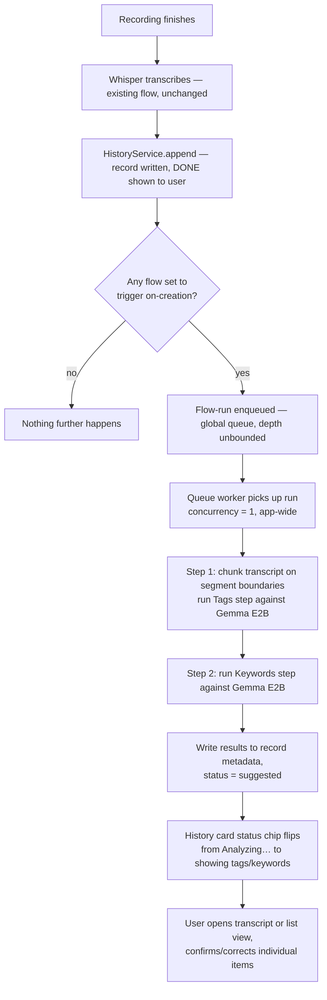
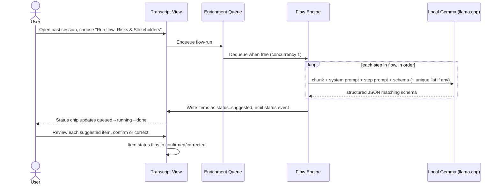
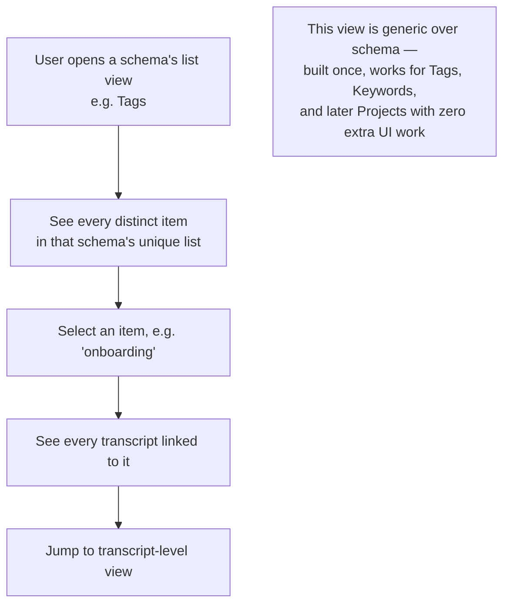
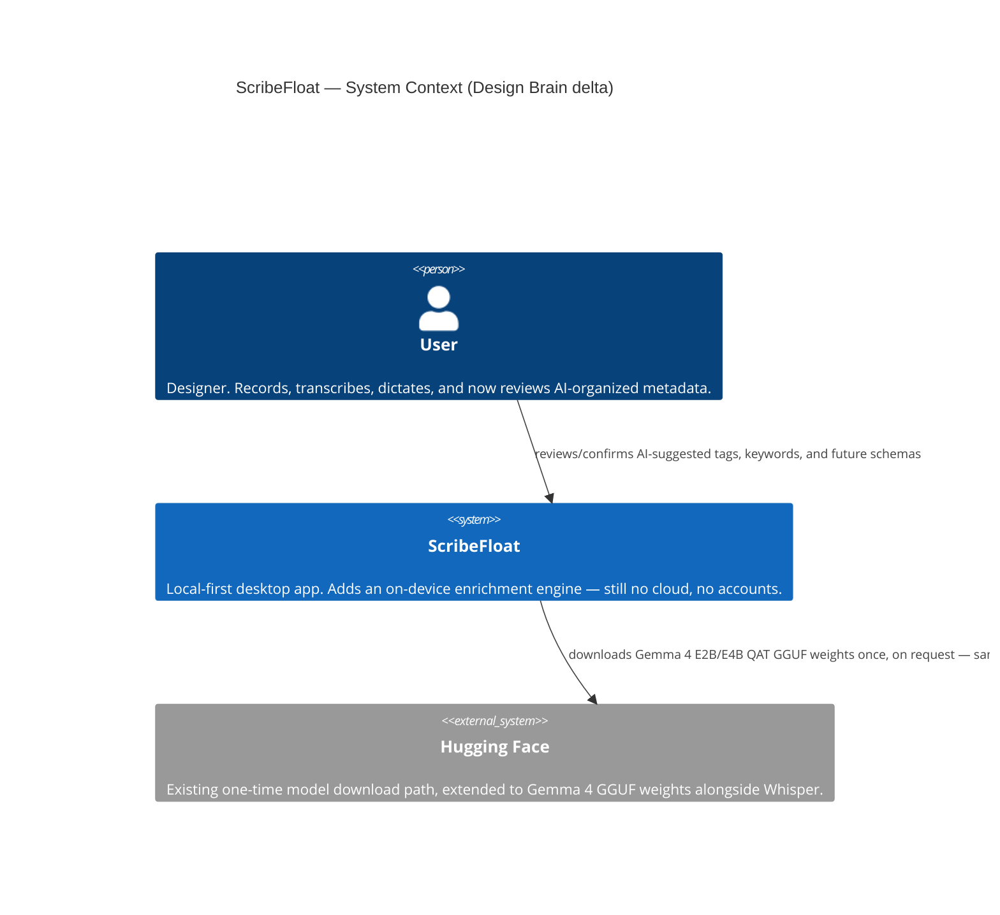
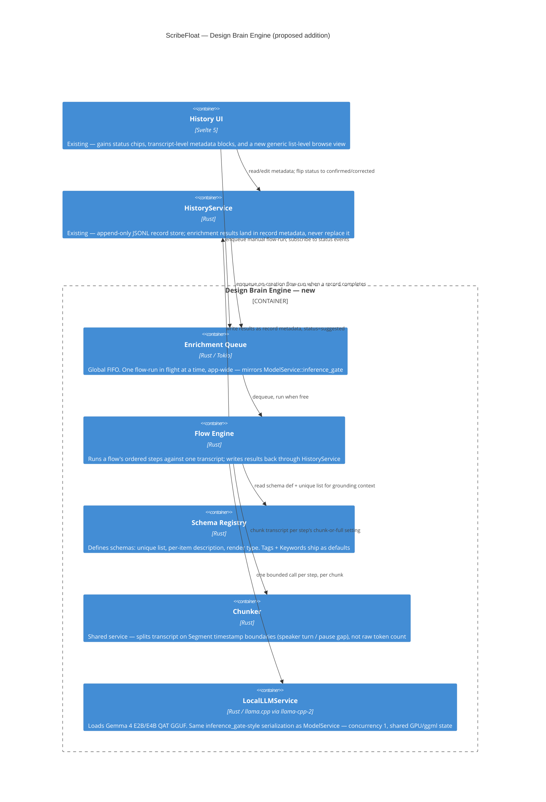

# PRD — "Design Brain" Enrichment Engine

> Status: **proposal / pre-spike**. Nothing in this document is built. This captures the ideation pass that led to the engine design, so the eventual spike has a fixed reference instead of re-deriving decisions from chat history.
> Diagrams in Mermaid, matching the convention in `context/architecture.md`.

---

## 1. Problem overview

ScribeFloat today is three capture workflows (Scribe, Dictate, Transcribe) writing into a flat, dated, append-only record store (`history.jsonl`). It captures a designer's spoken thinking faithfully — but transcription itself is a commodity; several well-funded competitors do "audio → text" well. Stopping there isn't a defensible position.

The reframe: ScribeFloat's voice-capture habit already gives it something competitors capturing meetings generically don't — a longitudinal record of *one designer's reasoning*, across every Scribe call, every dictated note, every imported file. The USP isn't transcription, it's becoming the designer's **decision memory** — a "design brain" that helps them recall why a call was made, and produce the artifact a stakeholder actually wants, without writing it by hand.

That reframe surfaces problems the current flat-list History UI doesn't solve:

| # | Problem | Why it's hard |
|---|---|---|
| 1 | **Organization friction** | Designers won't tag a project before every dictation — any "organize" feature must work passively, correction-only, never data-entry-first. |
| 2 | **A project is an identity, not a tag** | Client, phase, stakeholders — a manually-maintained ontology decays the moment it's not the path of least resistance. |
| 3 | **Decisions are buried in rambling speech** | "We decided X because Y, rejected Z" rarely comes out that cleanly — the valuable unit has to be *extracted*, not just stored verbatim. |
| 4 | **One transcript, many audiences** | A stakeholder update, a personal decision log, and a handoff doc all want different shapes of the same material. |
| 5 | **Recall, not retrieval** | "What did we decide about onboarding back in March" is a brain-like query; a dated flat list can't answer it. |
| 6 | **Trust in auto-organization** | Misfiled/misread content erodes trust fast; every AI-derived fact needs a cheap way to confirm or correct it, and downstream artifacts must be able to tell suggested apart from verified. |

---

## 2. What was explored, and the verdicts

| Idea | Verdict | Why |
|---|---|---|
| Vector DB (Qdrant/Weaviate/Pinecone) | **Deferred indefinitely** | This is one user's personal history, not a multi-tenant corpus — likely thousands of records, never millions. A real vector DB solves a scale problem this product doesn't have, and most want a server process, which fights the local-first story. |
| GraphQL | **Rejected for now** | Answers "how do multiple clients flexibly query a relational API over a network." There's one local app reading its own local store via Tauri IPC — no multi-client problem exists yet. Revisit only if a genuinely separate companion app needs a network query surface. |
| Embeddings for project-description / within-project chunk matching | **Deferred** | Both turned out to be one capability, not two staged layers — you can't match against a project-description vector without also embedding the incoming content, so there's no useful halfway point. Defer until plain-text grounding (inlining the existing tag/project vocabulary into the prompt) stops scaling. |
| Voice-triggered explicit tagging (extend the existing `float`-prefix word-replacement engine, e.g. `float tag onboarding`) | **Good idea, deferred** | Strongest possible trust signal (user said it directly, no verification needed) and reuses an existing convention — but it's a new *kind* of trigger action (metadata write + strip from text, not substitute-and-keep), and the replacement engine isn't heavily used yet. Revisit once the core engine ships. |
| Small local LLM (Gemma 4 family — E2B/E4B, Google's QAT Q4_0 GGUF builds) | **Adopted — core mechanism** | Matches the existing `whisper-rs`/ggml precedent exactly (bundled model, no network at runtime, same Metal/AVX2 feature-flag split). Google's QAT GGUF removes most quantization-quality risk. 128K context on the small variants is generous for single-session extraction. |
| Autonomous multi-turn agent loop (planning, tool calls, ReAct-style) | **Rejected** | Wrong shape for this problem. Every job here — classify, extract, tag — is answerable in one bounded call given the right input. A deterministic pipeline of single-shot steps is faster, predictable, and far easier to test than a model deciding what to do next. |
| Concurrent local-model inference (run N steps in parallel) | **Rejected — confirmed by existing code** | `ModelService::inference_gate` already serializes every Whisper call app-wide because concurrent `ggml`/Metal encode passes corrupt shared GPU state. `llama.cpp` shares the same `ggml` backend — the same constraint almost certainly applies. Concurrency is 1, by precedent, not just caution. |

---

## 3. The bet

**Build one general engine, not a list of point features.** The MVP use cases are deliberately narrow — Tags and Keywords — but the mechanism underneath (Schema → Step → Flow) has to be general enough that Decisions, Actions, Stakeholders, Risks, and Projects are *configuration added later*, not re-architecture. If a small on-device model can reliably do bounded, single-purpose extraction (tag a transcript, pull keywords) inside this engine, the same engine is the path to the harder, higher-value jobs (decision logs, stakeholder artifacts) that actually deliver on the "design brain" promise — without ever touching the pipeline code again.

Three constraints carry through every layer of the design, because they're what make the bet safe to make incrementally:

- **Always async, always decoupled.** Enrichment runs after `DONE`, never inside the Scribe/Dictate/Transcribe state machine. The core capture flow must never feel slower because this exists.
- **Concurrency = 1.** One global queue, one flow-run in flight at a time, matching the proven `inference_gate` pattern. This turns "how do we schedule this" into a non-problem.
- **Every AI-derived fact carries a status, not just a value.** `suggested → confirmed / corrected / rejected`. Seen is not verified — opening a session is not the same as confirming the AI got it right. Artifact generation (later) must be able to filter to confirmed-only by default.

---

## 4. User stories

**Capture & organize**
- As a designer, I want tags and keywords to appear on a session without doing anything, so that organization doesn't cost me extra effort on top of recording.
- As a designer, I want a wrong tag to be a one-tap fix, not a form, so that correcting the AI is cheaper than living with the mistake.
- As a designer, I want new tags to reuse existing vocabulary instead of inventing near-duplicates ("navbar" vs "navigation-bar"), so my tag list stays meaningful over time.

**Trust & review**
- As a designer, I want to tell at a glance whether a tag was AI-suggested or something I've confirmed, so I know what I can rely on later.
- As a designer, I want AI-suggested items that I never revisit to still surface somewhere, so nothing silently goes unreviewed forever.

**Customize & extend**
- As a power user, I want to define a new schema (e.g. "Risks") with my own prompt and output shape, so the engine grows with my needs without waiting on a release.
- As a power user, I want to choose how a new schema's data renders (chip list, task list, etc.) from existing templates, so I don't have to design new UI just to add a category.
- As a power user, I want exactly one flow to run automatically on every new session, and everything else to be a deliberate manual action, so I always know what's consuming compute and when.

**Recall (future, not MVP)**
- As a designer, I want to ask "what did we decide about onboarding before" and get an answer grounded in past sessions, so I don't have to re-listen to old recordings.
- As a designer, I want to generate a stakeholder update built only from confirmed decisions, so I never hand a client something the AI half-invented.

---

## 5. User workflows

### 5.1 Automatic enrichment after a Scribe/Dictate/Transcribe session



Key property: **C and J are the only two points the user perceives.** Everything between them is invisible background work — the user already has their transcript at C; F–I can take however long it takes without affecting felt latency.

### 5.2 Manual flow run + review



### 5.3 Authoring: Schema → Step → Flow

```mermaid
flowchart LR
    subgraph Schema creation
        S1[Name + description] --> S2[Unique list? on/off]
        S2 --> S3[Per-item description? on/off]
        S3 --> S4[Pick render type:\nchip-list / plain-list /\nitem+description / task-list]
    end
    subgraph Step creation
        T1[Name] --> T2[Pick target schema\n1 step → 1 schema]
        T2 --> T3[Chunk or full]
        T3 --> T4[Step-specific prompt\nsystem prompt is engine-level, inherited]
    end
    subgraph Flow creation
        F1[Name] --> F2[Add steps from library, order them]
        F2 --> F3{Trigger}
        F3 -- on-creation --> F4["Only one flow may hold this —\nclaiming it prompts to replace the current one"]
        F3 -- manual --> F5[Available as an explicit action\non any past or future session]
    end
    Schema creation --> Step creation --> Flow creation
```

### 5.4 Browsing organized data (list-level view)



---

## 6. Architecture (C4)

These extend `context/architecture.md` Level 1/2 — additive, not a replacement. Everything new stays inside the existing `Container_Boundary(app, ...)`; no new external systems beyond an optional one-time Gemma weight download mirroring the existing Hugging Face / Whisper pattern.

### 6.1 Level 1 — System Context (delta only)



### 6.2 Level 2 — Containers (new "Design Brain Engine" boundary)



### 6.3 Level 3 notes (not a full diagram yet — call out before the spike)

- `LocalLLMService` needs the same defensive load/cache pattern as `ModelService::get_or_load_context` — load once, keep warm, never reload per call.
- Structured output reliability should lean on grammar-constrained decoding (GBNF via llama.cpp) rather than hoping a 2–4B model returns clean JSON unaided.
- `Chunker` is shared infrastructure, not something each Step reimplements — this was explicitly flagged as a risk if left per-step.
- Render types are a small, fixed catalog (chip-list, plain-list, item+description, task-list) that the UI knows how to draw; a new Schema picks from this catalog rather than commissioning new UI.

---

## 7. Non-goals and open questions for the MVP spike

**Non-goals (explicitly deferred, not forgotten):**
- Project entity CRUD — Projects should ride on the same Schema/Step/Flow + list-view machinery later, not get bespoke UI now.
- Voice-triggered explicit tagging via the `float` word-replacement engine.
- More than one flow triggering on-creation.
- Step-to-step chaining / DAG ordering (flows are a flat ordered sequence for MVP; a step cannot yet declare "I need step M's output").
- Any embeddings/vector work.

**Open questions to resolve during/after the spike, not before:**
- Is the system prompt engine-wide (one shared framing for every step in every flow) or per-flow? Engine-wide is the simpler MVP default.
- How does a step's new value get promoted into a schema's shared unique list — automatically, or gated through the same suggested/confirmed status as everything else?
- Re-run semantics: if a flow is manually re-run on a session whose vocabulary has since grown, do new results merge with or replace the existing ones?
- Combined-vs-separate model calls per chunk when a flow has multiple steps — test both for latency before deciding.

---

## 8. Reference: where this connects to existing code

| Concept here | Existing precedent |
|---|---|
| `LocalLLMService` serialization | `ModelService::inference_gate` (`src-tauri/src/services/model.rs:171`) |
| Chunking on natural boundaries | `Segment` timestamps already produced by Whisper transcription |
| Status chip on History card | Existing Whisper `on_tick`-per-segment progress pattern |
| Metadata storage | Extends `HistoryRecord` (`src-tauri/src/types.rs:627`) — additive fields, not a new store |
| Transcript-level view | Extends History detail screen — must respect `docs/history-ui-review.md` layout contracts |
| Tag/keyword grounding without embeddings | Inlining the existing vocabulary as plain text in the prompt, within the 128K context budget |
