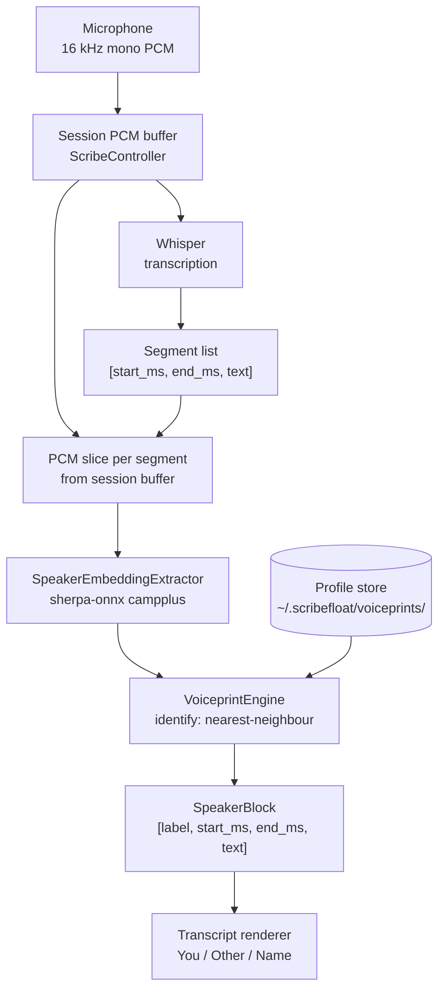
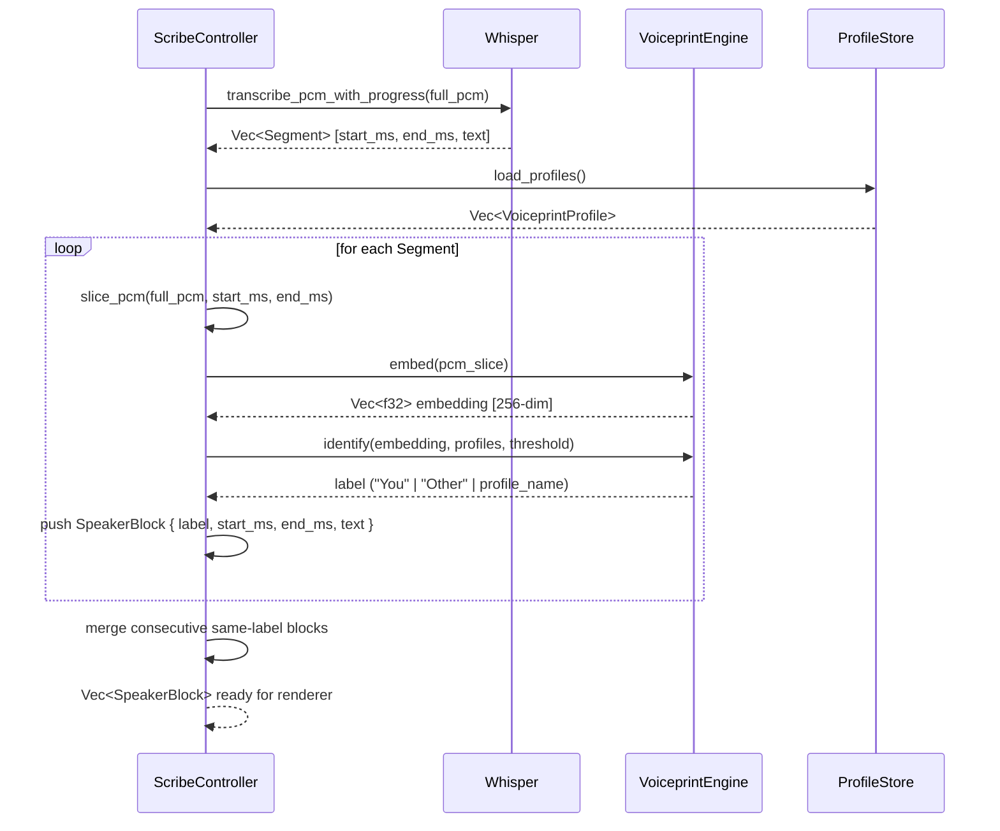
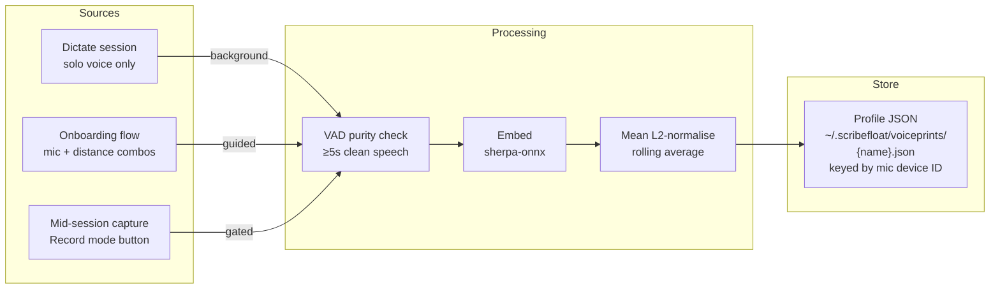
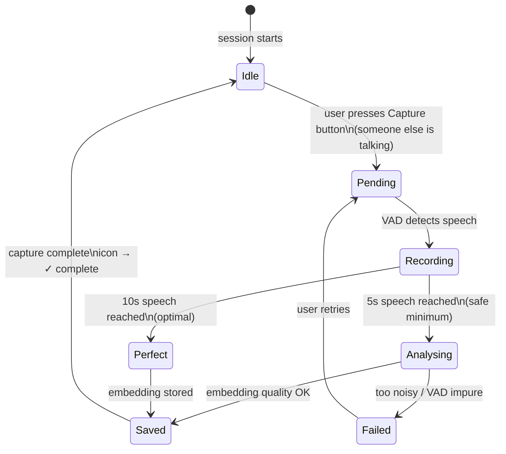

# Voiceprint Engine — Design & Integration Plan

Speaker verification for single-mic recordings. The goal is to label each Whisper segment as belonging to the user or someone else — so the user's own knowledge contributions are cleanly separated from external voices.

See **ADR-0011** for the architectural decision and crate evaluation.

---

## Integration Architecture

How audio flows from the microphone to a labelled transcript block.



---

## Data Flow — Segment Labelling

Detailed sequence from Whisper output to speaker label.



---

## Enrollment Data Flow

How voiceprints are built and stored across enrollment sources.



---

## Mid-Session Capture — State Machine

The capture button UX during a Record session.



---

## UI Controls

### Global settings (Settings panel → Voice tab)

| Control | Type | Default | Notes |
|---------|------|---------|-------|
| `user_display_name` | Text input | `"You"` | Label shown in transcript for the user's speech |
| `voice_similarity_threshold` | Slider 0.0–1.0, step 0.05 | `0.75` | Cosine similarity gate; lower = more inclusive |
| Enrolled profiles list | List + Add / Remove / Rename | — | Shows all saved voiceprints with mic device label |
| "Enroll my voice" button | Action | — | Launches onboarding flow |
| "Clear all voiceprints" | Destructive action | — | Confirmation required |

### Onboarding flow (first-time or manual re-enroll)

| Step | Control | Notes |
|------|---------|-------|
| 1 | Mic selector dropdown | Pick the mic to enroll against |
| 2 | Distance prompt | "Sit at normal distance" / "Move further back" (2–3 passes) |
| 3 | Record button | 10 s minimum; VAD purity bar shown |
| 4 | Progress indicator | Pending → Recording → Saved per pass |
| 5 | Finish screen | Summary: X clips enrolled, threshold recommendation |

### Record mode — mid-session capture

| Control | Type | Notes |
|---------|------|-------|
| Capture voiceprint button | Icon button in recording toolbar | Only visible during active Record session |
| VAD purity bar | Progress bar (green/amber/red) | Measures speech vs noise ratio in real time |
| Duration counter | `0s → 5s → 10s` with colour shift | Green at 5s (safe), gold at 10s (perfect) |
| State icon | Pending → Active → Complete (✓) | Resets to Idle on next press for retry |
| Profile name input | Text field (popover on first capture) | Default: "Other"; user can name stakeholder |
| Retry affordance | "Try again" appears on Failed state | Clears current buffer, restarts capture |

### Transcript view

| Control | Type | Notes |
|---------|------|-------|
| Speaker label chip | Inline `[You]` / `[Other]` / `[Name]` | Tap to rename profile (opens rename dialog) |
| Timestamp range | `[00:00 → 02:00]` | Hidden in no-timestamp variant |
| Speaker block separator | Subtle horizontal rule between speakers | |
| "Hide Other" toggle | Filter in transcript toolbar | Collapses all non-user blocks |
| "Show only me" toggle | Filter in transcript toolbar | Same as above, different framing |

---

## Transcript Output Format

### With timestamps (Record mode — has timing data)

```
[You]    [00:00 → 02:14]  So the core question here is whether we commit to the
                           new data model before Q3, or do we wait for the audit.

[Other]  [02:14 → 03:45]  I think we should wait. The audit might surface things
                           that change the design entirely.

[You]    [03:45 → 05:10]  Fair point. Let's set a hard deadline — if the audit
                           isn't done by the 15th we proceed anyway.

[Alice]  [05:10 → 06:00]  That works for me.
```

### Without timestamps (Dictate mode — no timing data)

```
[You]  So the core question here is whether we commit to the new data model...

[Other]  I think we should wait. The audit might surface things...
```

### Internal data structure

```rust
struct SpeakerBlock {
    label: String,       // "You", "Other", or profile name
    start_ms: Option<u64>,
    end_ms: Option<u64>,
    text: String,        // merged text of consecutive same-label Whisper segments
}
```

### Markdown export format

```markdown
**[You]** · 0:00–2:14

So the core question here is whether we commit to the new data model...

---

**[Other]** · 2:14–3:45

I think we should wait. The audit might surface things...
```

---

## User Journeys

### Journey 1 — Zero onboarding (auto-enrolled from Dictate)

1. User captures their first Dictate note (solo voice, no other speakers).
2. In the background, `VoiceprintService` detects no other profiles exist for this mic; accumulates the embedding silently.
3. After 3 Dictate sessions (~30 s total enrolled speech), the user profile is considered stable.
4. User records a meeting with Record mode.
5. Transcript arrives segmented: **[You]** and **[Other]** blocks already labelled — no configuration needed.
6. First time this renders, a toast: *"Speaker labels are on. Adjust in Settings → Voice."*

### Journey 2 — Manual onboarding (power user, multiple mics)

1. User opens Settings → Voice → "Enroll my voice".
2. Selects "Built-in microphone".
3. Guided through 3 recording passes: close / normal / slightly back.
4. VAD purity bar confirms each clip is clean; 10 s per pass.
5. Profile saved with mic device ID as key.
6. User repeats for "External USB microphone".
7. Going forward, the engine picks the profile matching the active mic automatically.

### Journey 3 — Mid-session stakeholder capture

1. User is in a Record session. A new person (Alice) starts talking.
2. User taps the **Capture voiceprint** button in the recording toolbar.
3. Icon shows Pending (clock). VAD purity bar appears — green as Alice speaks clearly.
4. At 5 s: counter turns green — safe to release. At 10 s: counter turns gold — optimal.
5. User holds until 10 s; taps Stop. Popover: "Name this speaker?" → user types "Alice".
6. Profile saved mid-session with timestamp.
7. After the meeting, the full session is transcribed. **Retroactive application**: all segments from the full recording (including before the capture) are labelled against all profiles including Alice's.
8. Transcript shows **[You]** / **[Alice]** / **[Other]** blocks.

### Journey 4 — Bad capture, retry

1. During mid-session capture, another speaker interrupts Alice.
2. VAD purity bar goes amber (mixed speech detected).
3. At 5 s, the purity indicator shows red — capture is impure.
4. State icon → Failed. "Try again" affordance appears.
5. User waits for Alice to be alone, taps "Try again".
6. Buffer clears; capture restarts cleanly.

### Journey 5 — Threshold tuning

1. User notices some of their own speech is being labelled **[Other]**.
2. Opens Settings → Voice → similarity threshold slider.
3. Slider currently at 0.75; user lowers to 0.65.
4. Retroactively re-labels the current session: **[You]** blocks expand.
5. User is satisfied; saves setting.

### Journey 6 — Named stakeholder management

1. User has accumulated profiles for Alice and Bob from past sessions.
2. Opens Settings → Voice → Enrolled profiles list.
3. Sees: "You (Built-in mic)", "You (USB mic)", "Alice", "Bob".
4. Renames "Bob" to "Bob (CEO)".
5. Deletes a stale profile "Unknown 1".
6. All future transcripts use updated names retroactively on re-label.

---

## Produces

- **ADR-0011** — `docs/adr/0011-voiceprint-engine-binary-speaker-verification.md`
- **Story 0052** — VoiceprintService core Rust service
- **Story 0053** — Auto-enroll user voice from Dictate sessions
- **Story 0054** — Voice profile onboarding UI (manual enrollment)
- **Story 0055** — Mid-session voiceprint capture during Record mode
- **Story 0056** — Speaker-labelled transcript format and renderer
- **Story 0057** — Named stakeholder profile management UI
- **Story 0058** — Config fields: `user_display_name`, `voice_similarity_threshold`
