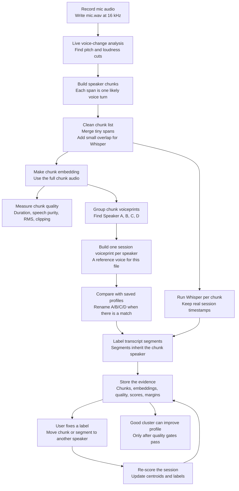
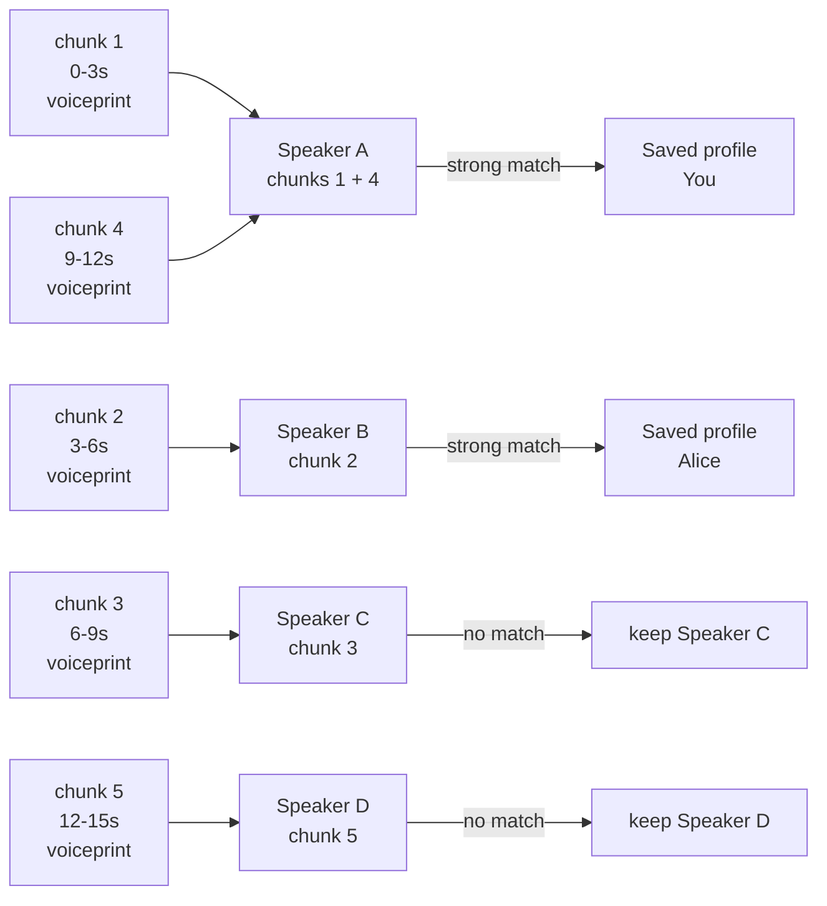

# Chunk-based speaker flow

Goal: use voice-change cuts to make better chunks. A chunk is one likely voice turn. Each chunk goes to Whisper. Each chunk also gets a voiceprint. The chunk voiceprints let the app find Speaker A, Speaker B, Speaker C, and Speaker D. No real name is needed yet. Saved profiles can then turn those local names into `You`, `Alice`, or `Bob`.



## 15 second example

This is a short upload or recording with four people. The names are not known at first. That is fine. The first task is not to name them. The first task is to find which chunks sound alike.

```text
0.0s  - 3.0s   Person 1 speaks
3.0s  - 6.0s   Person 2 speaks
6.0s  - 9.0s   Person 3 speaks
9.0s  - 12.0s  Person 1 speaks again
12.0s - 15.0s  Person 4 speaks
```

The cut finder turns that audio into chunks:

```text
chunk 1: 0.0s  - 3.0s
chunk 2: 3.0s  - 6.0s
chunk 3: 6.0s  - 9.0s
chunk 4: 9.0s  - 12.0s
chunk 5: 12.0s - 15.0s
```

Each chunk gets a voiceprint. The app compares those chunk voiceprints with each other. It asks: which chunks sound like the same person?

```text
chunk 1 voiceprint is close to chunk 4 voiceprint
chunk 2 voiceprint is not close to chunk 1, 3, 4, or 5
chunk 3 voiceprint is not close to chunk 1, 2, 4, or 5
chunk 5 voiceprint is not close to chunk 1, 2, 3, or 4
```

So the session speakers become:

```text
Speaker A = chunk 1 + chunk 4
Speaker B = chunk 2
Speaker C = chunk 3
Speaker D = chunk 5
```

Then saved profiles can rename those speakers. A saved profile is only used when the match is strong:

```text
Speaker A matches saved profile "You"     -> label as You
Speaker B matches saved profile "Alice"   -> label as Alice
Speaker C has no saved match              -> keep as Speaker C
Speaker D has no saved match              -> keep as Speaker D
```

The final transcript can then use stable labels:

```text
[You]       0.0s  - 3.0s   ...
[Alice]     3.0s  - 6.0s   ...
[Speaker C] 6.0s  - 9.0s   ...
[You]       9.0s  - 12.0s  ...
[Speaker D] 12.0s - 15.0s  ...
```

The key point: the app does not need a saved profile to find Speaker A, B, C, and D. It needs chunk voiceprints. Saved profiles come after that. They give real names when the match is strong.



## Record and upload

This works for Record and Upload.

- Record can find cuts live while `mic.wav` is written.
- Upload can find cuts after the audio file is decoded.
- After cuts exist, both paths use the same chunk flow.

## Current implementation note

The first code slice uses chunks for voiceprints and speaker labels. Whisper still runs once over the full mic audio. This avoids loading the Whisper model once per chunk.

Chunk spans aim for at least 2 seconds. If a cut lands just before a true 2-second turn, the boundary snaps to 2 seconds instead of being dropped. This protects short first turns, such as a 0-2s speaker.

True Whisper-per-chunk should wait for a batch path in `ModelService`. That path must load the model once, then run all chunks through the same loaded context.

## Plain flow

1. The app records `mic.wav` as it does today.
2. Live analysis finds points where the voice may have changed.
3. Those cut times become chunks.
4. Each chunk is one likely speaker turn.
5. Whisper runs on each chunk.
6. Each chunk gets a small overlap. This helps keep edge words.
7. Whisper times shift back to the full session clock.
8. The app makes one voice embedding for the full chunk.
9. The app groups chunk voiceprints inside the session.
10. Each group becomes a session speaker, such as Speaker A or Speaker B.
11. The app checks each session speaker against saved voice profiles.
12. Transcript segments get the label from their parent chunk.
13. The app stores the chunk, voiceprint, quality, group, label, score, and margin.
14. If the user fixes one label, the app can score the session again.
15. Related labels can then move with it.
16. If a group is clean and clear, it can improve a saved profile.

## Why this is better

Whisper segments are often too short for a good voiceprint. Chunks are longer. They are also closer to real turns. This means short transcript lines can still get a strong speaker label from the chunk they came from.

This also helps the app tell unknown speakers apart. Many people should not fall into one `Other` bucket. The session can have Speaker A, Speaker B, and Speaker C. Saved profiles can rename those speakers when there is a strong match.

## Naming and learning

When a user names a speaker in one transcript, the app should use the full speaker group, not only the clicked chunk.

Example:

```text
chunk 2: Speaker B speaks for 2s
chunk 7: Speaker B speaks for 15s

User renames Speaker B to Gilgamesh.
```

The label should move across the whole transcript group. Both chunks become `Gilgamesh`. The app then picks the clean evidence from that group. It should prefer the 15s clean chunk over the 2s chunk, or average all clean chunks in the group.

Each transcript should keep a speaker-level average:

```text
session speaker: Gilgamesh
clean chunks: chunk 2 + chunk 7
centroid: average voice embedding for this transcript
radius: how spread out the clean chunks are
duration: total clean speech time
quality: purity, RMS, clipping, margin
confirmed: true
```

The saved profile should keep accepted evidence from many transcripts:

```text
profile: Gilgamesh
evidence 1: transcript A, speaker B centroid
evidence 2: transcript D, speaker C centroid
evidence 3: transcript F, speaker A centroid
global centroid: weighted average of accepted evidence
radius: expected variation for Gilgamesh
exemplars: best clean examples
```

When new evidence is added, the app rebuilds the global profile from all accepted evidence. It should not only blend in the latest average and forget where it came from. This lets the app remove bad evidence later and recalculate the profile.

Detection should use the global centroid, the profile radius, the best examples, and the margin against the next closest profile. A match is good only when it is close to Gilgamesh and clearly better than the next person.

## Biometric data

Voice embeddings should be treated as sensitive local biometric data.

- Do not log raw vectors.
- Encrypt saved profile embeddings at rest.
- Encrypt stored chunk and session speaker embeddings at rest.
- Keep transcript text usable after embeddings are deleted.
- Add controls to forget one speaker, delete all voice data, and stop profile learning.
- Keep global profile learning explicit or opt-in.

## Implementation checkpoints

- [x] Checkpoint 1: Settings controls for voice learning, embedding retention, and encryption requirement. These store preferences only.
- [ ] Checkpoint 2: Transcript speaker evidence model with session speaker centroids.
- [ ] Checkpoint 3: Encrypted storage and voice data deletion controls.
- [ ] Checkpoint 4: Rebuildable global profiles from accepted evidence.
- [ ] Checkpoint 5: Quality-gated learning after user confirmation.

## Story impact

Stories 0059-0063 should move from segment-first voiceprints to chunk-first voiceprints.

- 0059 stores chunk voiceprints and quality signals.
- 0060 builds session centroids from chunk groups.
- 0061 scores chunks and child transcript segments against session centroids.
- 0062 lets a correction update the session groups and labels.
- 0063 stores accepted session speaker evidence and rebuilds global profiles from clean, clear centroids.
