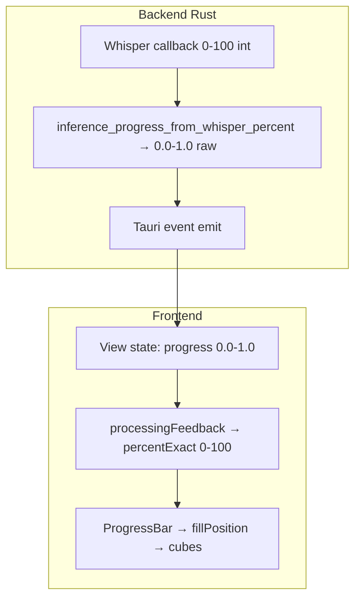

# Exploration: Progress numbers vs cube-grid bar

The cube animation works. The design-system slider demo feels good because **progress is smooth, frequent, and continuous**. Real capture flows do not feed the bar that way. This is a **data contract and timing** problem, not a CSS problem.

---

## What the bar expects

`ProgressBar` maps a single number `progress` (0–100) to a **fractional cube index**:

```
fillPosition = (progress / 100) × (rows × columns)
per cube:     fill = clamp(fillPosition - order, 0, 1)
```

That matches the HTML `setProgress()` scrubbing. It needs a **steady stream of 0–100 values**. The design-system demo does exactly that:

```276:285:src/routes/design-system/+page.svelte
  let progress = $state(0);
  $effect(() => {
    const startTime = Date.now();
    const interval = setInterval(() => {
      const elapsed = Math.min(8, (Date.now() - startTime) / 1000);
      progress = Math.round((elapsed / 8) * 100);
      // every 80ms, 0→100 over 8 seconds
```

Real dictate/scribe/upload never look like this.

---

## The pipeline (four layers, four scales)



| Layer | Scale | Example |
|-------|--------|---------|
| Whisper | 0–100 integer | 0, 1, 2 … 100 |
| Rust event `progress` | 0.0–1.0 float | 0.05 headroom + whisper × 0.95 |
| `processingFeedback` | 0–100 UI % | strips 5% headroom again on transcribe |
| `ProgressBar` | cube index | `(progress/100) × 96` for 3×32 grid |

Each layer can stall or jump independently.

---

## Problem 1: Long silent period at 0%

### Dictate on stop

```732:734:src-tauri/src/controllers/dictate.rs
                        progress: Some(0.0),
                        processing_stage: Some(ProcessingStage::LoadingModel),
```

Then **blocking work with no further events**:

- `session.mic.stop_and_finalize()`
- `read_wav_mono_f32`
- model path resolution / availability check
- only then `transcribe_capture` → first `progress_reporter` call

During all of that, the UI has:

- `rawProgress = 0`
- `stage = LOADING_MODEL` → `percentExact = 0`
- `indeterminate = true` → bar runs **indeterminate wave**, not progress scrub

User perception: "I stopped recording, nothing's happening."

### Headroom double-whammy

Backend reserves the first **5%** of raw for model load:

```1121:1127:src-tauri/src/services/model.rs
pub const INFERENCE_MODEL_LOAD_PROGRESS: f32 = 0.05;
fn inference_progress_from_whisper_percent(percent: i32) -> f32 {
    INFERENCE_MODEL_LOAD_PROGRESS
        + progress_from_whisper_percent(percent) * (1.0 - INFERENCE_MODEL_LOAD_PROGRESS)
}
```

Frontend **strips that same 5%** again for display:

```63:66:src/lib/utils/processingFeedback.ts
	const percentExact =
		stage === 'TRANSCRIBING_AUDIO'
			? (Math.max(0, clamped - MODEL_LOAD_HEADROOM) / (1 - MODEL_LOAD_HEADROOM)) * 100
```

So when Whisper first reports `0%`, raw is `0.05`, but **`percentExact` is still 0**. The bar stays in indeterminate/empty until Whisper moves past ~0%.

**Net effect:** model load + WAV finalize + headroom = a large window where the "real" percent the bar cares about is stuck at 0.

---

## Problem 2: Sparse, bursty backend updates

Whisper progress is throttled:

```1152:1168:src-tauri/src/services/model.rs
    if (percent - last).abs() >= 1 { return true; }
    since_last_emit >= Duration::from_millis(100)
```

On **short dictate clips**, inference can finish in under a second. You may get:

1. `0.05` (model slice)
2. nothing…
3. `1.0` (Whisper 100%)

Two or three events total. The slider demo sends **~100 updates over 8 seconds**. Same component, totally different input.

---

## Problem 3: Dictate never "finishes" the bar on success

Successful dictate does **not** emit `progress: 1.0` then hold. It goes:

1. `TRANSCRIBING` + whisper progress
2. `PASTING` — **no `progress` or `processing_stage` in the event**
3. `transition_to_idle()` — window hides, bar unmounts

```972:994:src-tauri/src/controllers/dictate.rs
        self.transition_to_idle();
        // ...
        inner.state = DictateState::Idle;
        self.emit_state_event(&inner);
        self.hide_window();
```

`isProcessing` is only true for `TRANSCRIBING | PASTING`:

```55:57:src/lib/ui/5_views/dictate.svelte
	const isProcessing = $derived(
		dictateState === "TRANSCRIBING" || dictateState === "PASTING",
	);
```

So even if the last whisper tick was `percentExact = 85`, the bar disappears before the user sees 100%. Compare **Scribe**, which explicitly sets `progress = 1` on `DONE` in the store.

---

## Problem 4: Post-transcription stages don't move the bar (Scribe/Upload)

Scribe jumps raw progress to **1.0** when writing the transcript:

```1021:1028:src-tauri/src/controllers/scribe.rs
                ScribeStateEvent {
                    progress: Some(1.0),
                    processing_stage: Some(ProcessingStage::WritingTranscript),
```

But `processingFeedback` only remaps headroom for `TRANSCRIBING_AUDIO`. For `WRITING_TRANSCRIPT`, `percentExact = clamped × 100` → 100. Bar snaps to full while work continues — or feels "done" while it isn't.

Upload uses `overall_progress(queue)` — average of per-item `0..1` — a **third** semantics (batch queue, not single capture).

---

## Problem 5: Mode switch in `ProgressBar` at the worst moment

When `indeterminate === true` (`percent === 0`), the bar uses **`indeterminateHead`** (animated wave), not progress:

```149:151:src/lib/ui/1_primitives/display/ProgressBar.svelte
	const fillPosition = $derived(
		indeterminate ? indeterminateHead : (smoothProgress / 100) * totalCubes,
```

When the first non-zero `percentExact` arrives, it flips to **`smoothProgress`** chase at 90%/sec. That's a discontinuity: wave → scrub, often right before the UI unmounts.

---

## Problem 6: Extra lag on top of already-late numbers

Even after `percentExact` updates, `smoothProgress` deliberately **lags** target by up to ~1s on a 0→100 jump. Combined with Problem 3, the bar often **unmounts before catch-up finishes**.

---

## Why the design-system feels fine but dictate doesn't

| | Design-system demo | Real dictate |
|--|-------------------|--------------|
| Update rate | every 80ms | 0–3 events typical |
| Curve | linear 0→100 over 8s | flat, then jump |
| Duration on screen | 8+ seconds | often <2s |
| End behaviour | stays visible at 100% | hide window / idle |
| Starting point | 0 with immediate ticks | 0 for seconds (silent backend) |

Same `ProgressBar`, different **signal**.

---

## Root cause (one sentence)

**The bar is built for a smooth 0–100 scrub signal; capture pipelines emit sparse 0.0–1.0 raw progress with headroom stripping, long silent phases, no terminal "100% + hold", and immediate UI teardown on success.**

---

## Fix directions (numbers only — not animation)

These are the levers, in rough priority:

1. **Unify a "display progress" contract**
   One 0–100 float meant for visuals: monotonic, covers full pipeline (load → transcribe → paste/write), doesn't reset mid-run.

2. **Fill the dead zone**
   Emit synthetic progress during WAV finalize / model warm-up (e.g. 0→5% over time or stage-weighted), or stop mapping that time to `percentExact === 0`.

3. **Revisit headroom**
   Either report load in UI % explicitly (0–5% = loading model) or don't strip 5% on the frontend if backend already encoded it — pick one layer, not both.

4. **Terminal event**
   Dictate: emit `progress: 1.0` (or `percentExact: 100`) on success; hold bar ~500ms before `idle`/hide.

5. **Remove or bypass `smoothProgress` lag** for capture UIs — scrub directly from `percentExact`; smoothing hides sparse jumps but also hides the finish.

6. **Stage-weighted progress**
   e.g. Dictate: Loading 0–10%, Transcribing 10–90%, Pasting 90–100% — so something moves even when Whisper is silent.

7. **Logging pass**
   Temporarily log `(stage, rawProgress, percentExact, dictateState)` per event to confirm timing on the target machine.

---

## Outcome — implemented 2026-07-06

All six problems confirmed against the code; levers 1, 3, 4, 5, and 6 implemented directly (no story needed):

- **`processingFeedback.ts`** now owns the display contract: each stage in a
  profile gets a disjoint band of 0–100 (Loading 10, Transcribing 80, Writing
  10; the last step absorbs the remainder — Dictate transcribing runs 10–100).
  Headroom is stripped once, into the transcribing band, so raw `0.05` renders
  as the band start (10%), not 0%. Stages with no measurable progress (writing,
  cleanup) park at their band start instead of snapping to 100. `indeterminate`
  is now only `LOADING_MODEL`, so the wave→scrub flip happens once, early.
- **`batchProcessingFeedback`** (new) — the Upload queue maps its queue-average
  straight to percent (monotonic across items); stage only drives the step
  sequence. Fixes the mid-queue indeterminate flash and backward jumps.
- **`dictate.rs`** — the Pasting event now carries `progress: 1.0` +
  `TranscribingAudio`, and success holds 450ms (`DICTATE_COMPLETE_HOLD`) before
  `transition_to_idle()`, so the bar visibly completes before the window hides.
- **`ProgressBar.svelte`** — catch-up time is capped at 350ms for any jump
  (`MAX_CATCH_UP_SECONDS`); small deltas keep the 90%/s feel.

**Round 2 (same day)** — on-device the indeterminate wave read as "fills then
restarts" during long model loads, the number sat at 0%, and the fixed 32-column
grid didn't span its container. Lever 2 implemented properly:

- **`stores/captureProgress.svelte.ts`** (new) — per-run display store. Real
  backend ticks anchor the value via the band contract (batch mode anchors to
  the queue average); between ticks it *creeps* toward the current band end,
  capped at 1.5%/s and never more than 10% ahead of the last real number. The
  label percent and the cubes read the same state, so both always move and
  never wrap. Capture views no longer use `indeterminate` at all — the looping
  wave now exists only for the design-system demo.
- **`ProgressBar` gained `fluid`** — measures its container and derives the
  column count (up to 160), so capture bars span the available width.
- Scribe's `stopAndSave` seeds the store immediately, so creep starts the
  moment the user clicks Stop, before the first backend event.

**Round 3 (same day)** — banded creep was honest but stuttery on short runs
(crawl → jump → sprint); the demo feels good because it is *time-paced*. Single
runs (Dictate, Scribe) now glide on a clock instead:

- `begin(hintSeconds)` — the view estimates press-to-paste duration from the
  recording length (Dictate `1.5 + 0.25×s`, Scribe `3 + 0.3×s`); the store
  corrects the hint with a per-flow speed factor persisted in localStorage
  (`sf-capture-eta:<key>`), learned from how long runs actually took (EMA,
  first observation counts fully). The bar fills ~92% of the way to a 97
  ceiling over the expected window.
- Real backend ticks remain floors (never pull backwards); only a real
  terminal (raw ≥ 1 or `complete()`) passes 97 and sweeps to 100.
- Bands no longer cap the glide for single runs — smoothness beats
  stage-truth there. Batch (Upload) keeps the anchored creep, since the queue
  average is a real continuous signal.

**Round 4 (2026-07-07)** — model load split out of the bar entirely. While the
initial load blocks the run (`CaptureProgress.loading`: stage `LOADING_MODEL`
and no progress yet), views show "Loading model" with an `AnimatedEllipsis`
primitive instead of the bar; the glide clock arms at `begin()` but starts on
the first transcribe tick, so pacing and the learned speed factor measure pure
transcription (estimate keys bumped to `dictate-transcribe` /
`scribe-transcribe` to relearn cleanly). A mid-queue stage regression in Upload
does not re-enter the loading treatment.

**Round 5 (2026-07-07)** — "model loading is still a thing" in Scribe was a
*label* lie, not a cache miss. The preload works (same `resolve_model_path`
resolution, session-lifetime per-path cache, no GPU-fallback evictions since
2026-06-25); the visible wait after Stop & Save is `prepare_audio` — WAV
finalize + full-recording read + speaker-track merge/rewrite — which ran
before any event and rendered as "Loading model…". Added
`ProcessingStage::PreparingAudio` (wire: `PREPARING_AUDIO`): Scribe emits it
before `prepare_audio`, Dictate's stop event uses it (its model is preloaded;
the wait is WAV finalize), Upload's per-item emit uses it (the wait is
`decode_input`). The store's `loading` covers both pre-transcribe stages and
exposes `stageLabel`, so the dots now say "Preparing audio…" or
"Loading model…" per what is actually happening.

**Round 6 (2026-07-07)** — whisper init logs at stop time revealed two real
stop-time costs beyond labels:

- `transcribe_pcm_with_progress` re-hashed the whole model file (SHA-256,
  ~0.5s for small.en, seconds for large) on **every** transcription. Now
  `model_integrity_ok_cached` verifies once per session, stamped with
  (mtime, len) so a re-download or manual replacement re-hashes automatically;
  `preload_context` also warms the verification during the recording window.
- In dev, every backend rebuild empties the in-memory context cache, so cold
  `whisper_init_from_file` at stop is routine while iterating on Rust code —
  not a regression signal. In production the cache lives for the app session.

Remaining first-run-per-context cost: `whisper_init_state` + Metal kernel
pipeline compilation happen at stop (visible as the kernel compile burst in
the log). Warming those would require running a short dummy inference during
recording — deferred.

Still open:

- **Upload Whisper preload** — Upload still cold-loads Whisper at Start; the
  warm-up seam is the human dead-time between queueing files / picking a model
  and clicking Start (`preload_context` via a small IPC; load lock makes it
  race-safe).
- **Lever 7** (logging pass) — do ad hoc if timing still feels off on-device.
- **Optional ADR**: single definition of 0–100 across Dictate / Scribe / Upload
  (the contract now lives in `processingFeedback.ts` / `captureProgress` docs).
