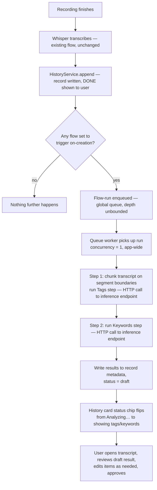
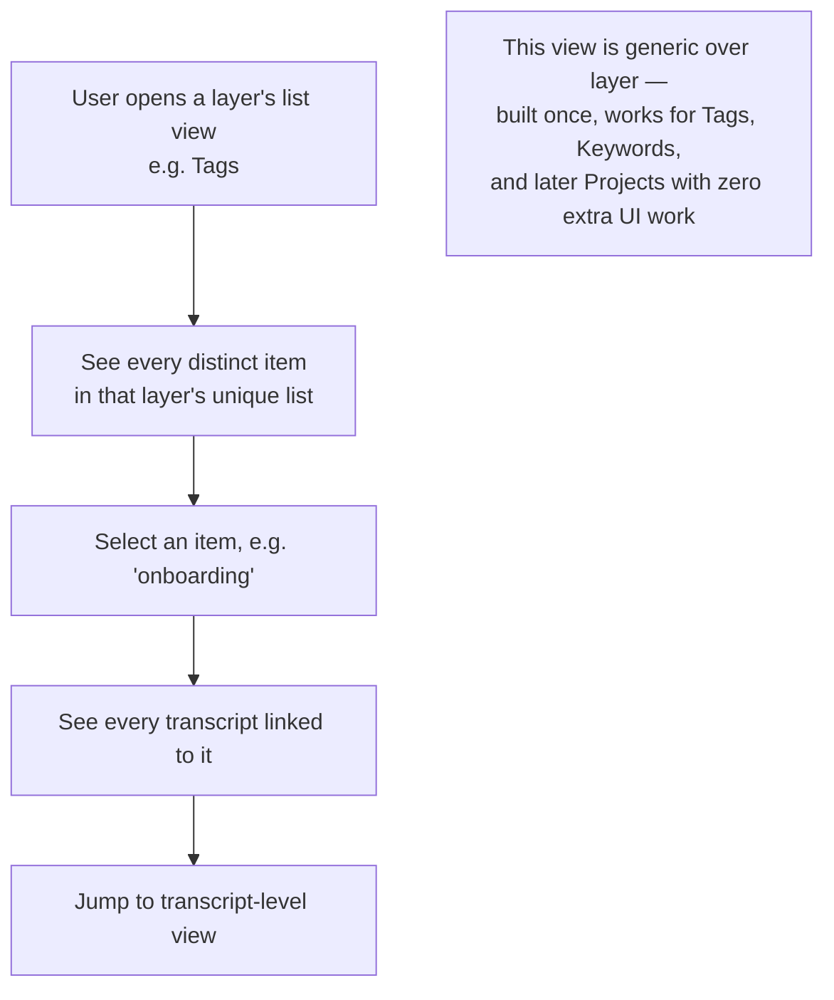
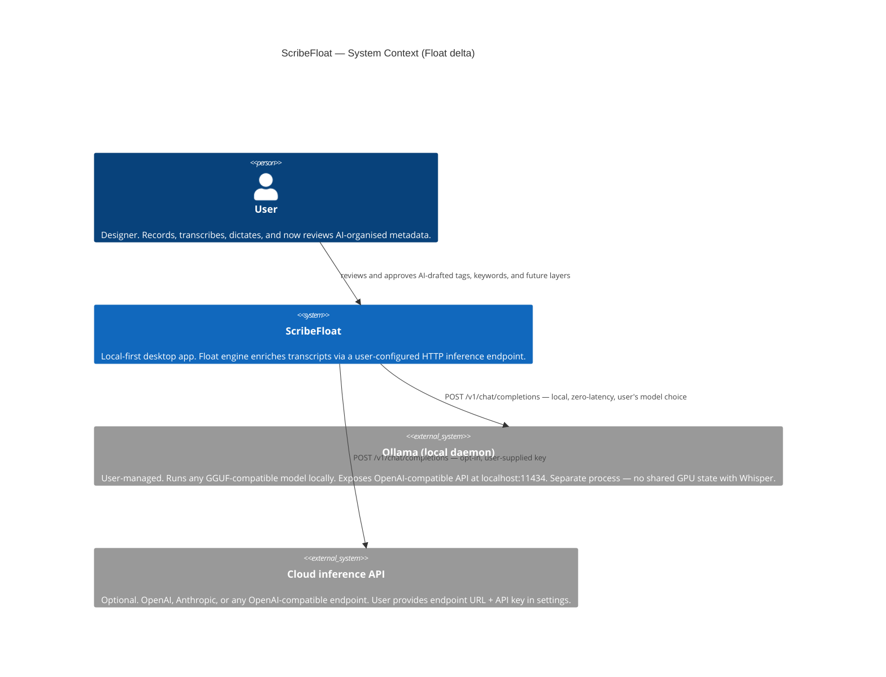
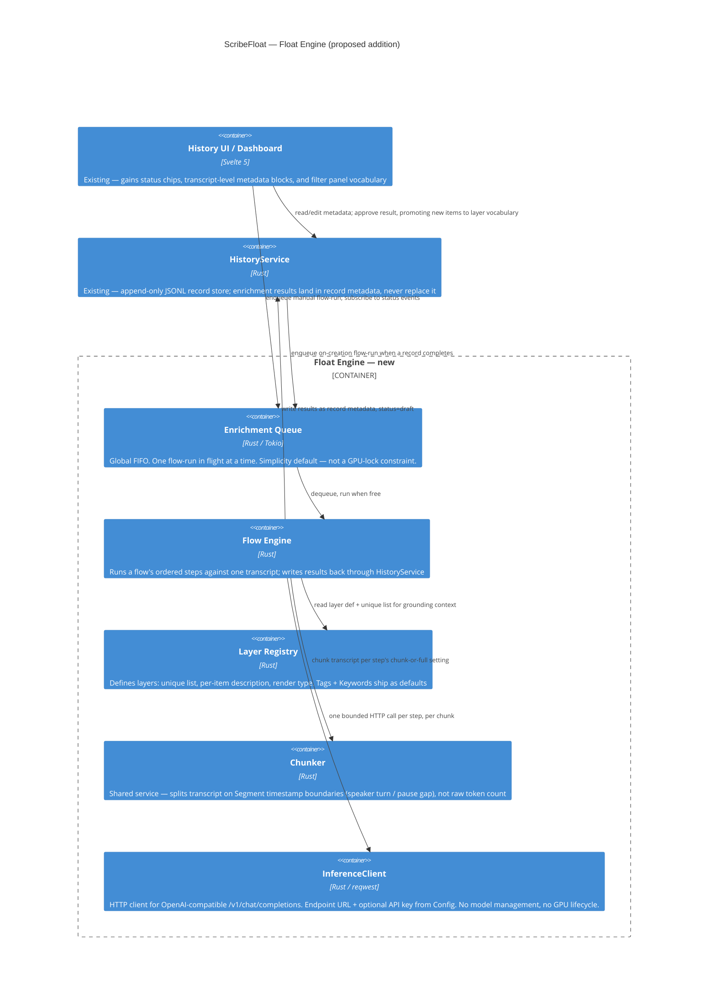

# PRD — "Design Brain" Enrichment Engine

> Status: **proposal / pre-spike**. Nothing in this document is built. This captures the ideation pass that led to the engine design, so the eventual spike has a fixed reference instead of re-deriving decisions from chat history.
> Diagrams in Mermaid, matching the convention in `docs/architecture.md`.

---

## 1. Problem overview

ScribeFloat today is three capture workflows (Scribe, Dictate, Transcribe) writing into a flat, dated, append-only record store (`history.jsonl`). It captures a designer's spoken thinking faithfully — but transcription itself is a commodity; several well-funded competitors do "audio → text" well. Stopping there isn't a defensible position.

The reframe: ScribeFloat's voice-capture habit already gives it something competitors capturing meetings generically don't — a longitudinal record of *one designer's reasoning*, across every Scribe call, every dictated note, every imported file. The USP isn't transcription, it's becoming the designer's **decision memory** — a "design brain" that helps them recall why a call was made, and produce the artifact a stakeholder actually wants, without writing it by hand.

That reframe surfaces problems the current flat-list History UI doesn't solve:

| # | Problem | Why it's hard |
|---|---|---|
| 1 | **Organization friction** | Designers won't tag a project before every dictation — any "organize" feature must work passively, correction-only, never data-entry-first. |
| 2 | **A project is an identity, not a tag** | Client, phase, stakeholders — a manually-maintained ontology decays the moment it's not the path of least resistance. |
| 3 | **Decisions are buried in rambling speech** | "We decided X because Y, rejected Z" rarely comes out that cleanly — the valuable unit has to be *extracted*, not just stored verbatim. |
| 4 | **One transcript, many audiences** | A stakeholder update, a personal decision log, and a handoff doc all want different shapes of the same material. |
| 5 | **Recall, not retrieval** | "What did we decide about onboarding back in March" is a brain-like query; a dated flat list can't answer it. |
| 6 | **Trust in auto-organization** | Misfiled/misread content erodes trust fast; every AI-derived fact needs a cheap way to confirm or correct it, and downstream artifacts must be able to tell suggested apart from verified. |

---

## 2. What was explored, and the verdicts

| Idea | Verdict | Why |
|---|---|---|
| Vector DB (Qdrant/Weaviate/Pinecone) | **Deferred indefinitely** | This is one user's personal history, not a multi-tenant corpus — likely thousands of records, never millions. A real vector DB solves a scale problem this product doesn't have, and most want a server process, which fights the local-first story. |
| GraphQL | **Rejected for now** | Answers "how do multiple clients flexibly query a relational API over a network." There's one local app reading its own local store via Tauri IPC — no multi-client problem exists yet. Revisit only if a genuinely separate companion app needs a network query surface. |
| Embeddings for project-description / within-project chunk matching | **Deferred** | Both turned out to be one capability, not two staged layers — you can't match against a project-description vector without also embedding the incoming content, so there's no useful halfway point. Defer until plain-text grounding (inlining the existing tag/project vocabulary into the prompt) stops scaling. |
| Voice-triggered explicit tagging (extend the existing `float`-prefix word-replacement engine, e.g. `float tag onboarding`) | **Good idea, deferred** | Strongest possible trust signal (user said it directly, no verification needed) and reuses an existing convention — but it's a new *kind* of trigger action (metadata write + strip from text, not substitute-and-keep), and the replacement engine isn't heavily used yet. Revisit once the core engine ships. |
| Small local LLM via llama-cpp-2 (Gemma 4 family, GGUF bundled in-process) | **Reconsidered — superseded by HTTP-based inference** | Eliminated by the concurrency problem: `llama.cpp` shares the same `ggml`/Metal GPU backend as Whisper — running both in-process requires app-wide serialization, making Whisper wait on LLM jobs. Also adds significant build complexity (native bindings, GGUF download/management, Metal feature flags). |
| HTTP-based inference endpoint (Ollama local daemon or cloud API key) | **Adopted — core mechanism** | Float becomes a configurable HTTP client (`POST /v1/chat/completions`, OpenAI-compatible). User points it at their Ollama instance (`http://localhost:11434`) or a cloud provider. ScribeFloat owns zero model management — no GGUF files, no download flow, no Metal lifecycle code. The concurrency problem dissolves: Ollama is a separate process with its own GPU context; OS manages Metal scheduling between Whisper and Ollama. Cloud API (OpenAI, Anthropic, etc.) is a zero-GPU alternative — user opts in by providing an API key and endpoint URL. Both use the same HTTP client code; the distinction is just configuration. |
| Autonomous multi-turn agent loop (planning, tool calls, ReAct-style) | **Rejected** | Wrong shape for this problem. Every job here — classify, extract, tag — is answerable in one bounded call given the right input. A deterministic pipeline of single-shot steps is faster, predictable, and far easier to test than a model deciding what to do next. |
| Concurrent local-model inference (run N steps in parallel) | **Rejected — still applies within a session** | `ModelService::inference_gate` serializes Whisper app-wide; that constraint is unchanged. Float always runs after transcription completes, so Whisper and Float never race. Multiple Float Steps within one Flow still run sequentially — queue concurrency is 1. This is a simplicity choice; the GPU-lock problem that forced it with llama-cpp-2 is gone with Ollama. |

---

## 3. The bet

**Build one general engine, not a list of point features.** The MVP use cases are deliberately narrow — Tags and Keywords — and the mechanism underneath (Layer → Step → Flow) delivers those reliably as a lightweight vocabulary-building layer: filter notes, link them together, provide routing signals for downstream processing.

**Design evolution (see [`knowledge-orchestration.md`](knowledge-orchestration.md)):** Decisions, Actions, Stakeholders, and other knowledge types are *not* additional Layers in this engine. They are a separate second-level engine — the knowledge extraction layer — that uses the same underlying HTTP runner but writes to markdown files in the knowledge folder rather than HistoryRecord metadata. The Layer/Step/Flow engine's job is Tags and Keywords only. The bet that "the same pipeline is the path to decision logs and stakeholder artifacts" was directionally right (same HTTP runner, same prompt pattern) but wrong about storage and execution model — those are different enough to warrant a separate engine. The two-flow separation is the correct architecture: Flow 1 (Tags + Keywords, lightweight, runs on every note) feeds and enables Flow 2 (knowledge extraction, heavier, selective, runs after Flow 1 is approved).

Three constraints carry through every layer of the design, because they're what make the bet safe to make incrementally:

- **Always async, always decoupled.** Enrichment runs after `DONE`, never inside the Scribe/Dictate/Transcribe state machine. The core capture flow must never feel slower because this exists.
- **Concurrency constraint is dissolved by the HTTP backend.** With Ollama as a separate process, there is no shared `ggml`/Metal GPU lock between Whisper and Float — the OS manages GPU scheduling between processes. Float jobs are independent HTTP requests; `ModelService::inference_gate` still serializes Whisper as before but Float doesn't touch that gate. The Float queue runs one job at a time as a simplicity default (not a hardware constraint). Whisper takes natural priority because Float only runs after `DONE` — they don't overlap in the normal flow.
- **Every AI-derived result carries a status at the transcript level.** When a Flow runs on a Transcript the result is `draft`. The user can edit individual items (flips to `edited`) and explicitly approve the whole result (`approved`). On approve, new items are auto-promoted into the Layer's shared vocabulary. Artifact generation (later) must be able to filter to approved-only by default.

---

## 4. Object model

Five hardcoded types. Tags and Keywords are the two default seed Layers — they serve filtering, linking, and domain routing. **Decisions, Actions, Stakeholders, etc. are not Layers in this engine** — they live in the knowledge extraction layer (see [`knowledge-orchestration.md`](knowledge-orchestration.md)) and produce markdown files, not vocabulary items. Everything beyond Tags and Keywords in this engine is user-created configuration for additional lightweight vocabulary extraction.

| Object | What it is |
|---|---|
| **Transcript** | Existing `HistoryRecord`. Enrichment results are additive metadata on this record — nothing is replaced. |
| **Layer** | A named extraction type. Defines: name, optional description, unique list on/off, per-item description on/off, render type (chip-list / plain-list / item+description / task-list). The Layer's vocabulary (unique list) starts empty and grows over time. |
| **Item** | A vocabulary entry belonging to a Layer. Name + optional one-line description. Shared across all Transcripts for that Layer. In the UI, the user edits items as plain text (`name\|description` per line); the same format is trivially LLM-parseable. |
| **Step** | A single extraction instruction: target Layer, step-specific prompt, chunk strategy (segment-boundary chunks or full transcript). Reusable across Flows. |
| **Flow** | An ordered sequence of Steps with a trigger: `on-creation` (exclusive — only one Flow may hold this) or `manual`. Running a Flow on a Transcript produces a result with a status. |

### Status model

Status lives at the **transcript × flow result** level, not per item:

| Status | Meaning |
|---|---|
| `draft` | Flow ran, LLM produced the result, user hasn't touched it |
| `edited` | User has made changes but hasn't approved |
| `approved` | User explicitly signed off — triggers auto-promotion of new items into the Layer's vocabulary |

**On Approve:** any items in the result that don't yet exist in the Layer's unique list are added automatically. This is the only point at which new vocabulary enters the shared list.

### Creation model

Layer and Step can be created two ways — neither is primary:
- **Describe it** — plain language input → the local LLM scaffolds the object → user confirms or edits
- **Build it** — fill the form directly

Flow is always assembled manually (pick existing Steps, set trigger, order them).

---

## 5. User stories

**Capture & organize**
- As a designer, I want tags and keywords to appear on a session without doing anything, so that organization doesn't cost me extra effort on top of recording.
- As a designer, I want a wrong tag to be a one-tap fix, not a form, so that correcting the AI is cheaper than living with the mistake.
- As a designer, I want new tags to reuse existing vocabulary instead of inventing near-duplicates ("navbar" vs "navigation-bar"), so my tag list stays meaningful over time.

**Trust & review**
- As a designer, I want to tell at a glance whether a tag was AI-suggested or something I've confirmed, so I know what I can rely on later.
- As a designer, I want AI-suggested items that I never revisit to still surface somewhere, so nothing silently goes unreviewed forever.

**Customize & extend**
- As a power user, I want to define a new Layer (e.g. "Risks") by describing what I want in plain language, so the engine grows with my needs without filling out a form.
- As a power user, I want to choose how a new Layer's data renders (chip list, task list, etc.) from existing templates, so I don't have to design new UI just to add a category.
- As a power user, I want exactly one flow to run automatically on every new session, and everything else to be a deliberate manual action, so I always know what's consuming compute and when.

**Recall (future, not MVP)**
- As a designer, I want to ask "what did we decide about onboarding before" and get an answer grounded in past sessions, so I don't have to re-listen to old recordings.
- As a designer, I want to generate a stakeholder update built only from confirmed decisions, so I never hand a client something the AI half-invented.

---

## 6. User workflows

### 6.1 Automatic enrichment after a Scribe/Dictate/Transcribe session



Key property: **C and J are the only two points the user perceives.** Everything between them is invisible background work — the user already has their transcript at C; F–I can take however long it takes without affecting felt latency.

### 6.2 Manual flow run + review

```mermaid
sequenceDiagram
    actor User
    participant TV as Transcript View
    participant Q as Enrichment Queue
    participant FE as Flow Engine
    participant LLM as Inference endpoint (Ollama / cloud)

    User->>TV: Open past session, choose "Run flow: Risks & Stakeholders"
    TV->>Q: Enqueue flow-run
    Q->>FE: Dequeue when free (concurrency 1)
    loop each step in flow, in order
        FE->>LLM: POST /v1/chat/completions — chunk + system prompt + step prompt + layer def (+ unique list if any)
        LLM-->>FE: JSON response matching layer schema
    end
    FE->>TV: Write items as status=draft, emit status event
    TV-->>User: Status chip updates queued→running→done
    User->>TV: Review draft items, edit as needed, approve
    TV->>TV: Result status → edited (on any change) or approved;\non approve, new items promoted to Layer vocabulary
```

### 6.3 Authoring: Layer → Step → Flow

```mermaid
flowchart LR
    subgraph Layer creation
        S0{Describe it or\nbuild it?}
        S0 -- describe --> S0a[Plain language input\nLLM scaffolds the Layer\nUser confirms or edits]
        S0 -- build --> S1[Name + description]
        S1 --> S2[Unique list? on/off]
        S2 --> S3[Per-item description? on/off]
        S3 --> S4[Pick render type:\nchip-list / plain-list /\nitem+description / task-list]
    end
    subgraph Step creation
        T0{Describe it or\nbuild it?}
        T0 -- describe --> T0a[Plain language input\nLLM scaffolds the Step\nUser confirms or edits]
        T0 -- build --> T1[Name]
        T1 --> T2[Pick target layer\n1 step → 1 layer]
        T2 --> T3[Chunk or full]
        T3 --> T4[Step-specific prompt\nsystem prompt is engine-level, inherited]
    end
    subgraph Flow creation
        F1[Name] --> F2[Add steps from library, order them]
        F2 --> F3{Trigger}
        F3 -- on-creation --> F4["Only one flow may hold this —\nclaiming it prompts to replace the current one"]
        F3 -- manual --> F5[Available as an explicit action\non any past or future session]
    end
    Layer creation --> Step creation --> Flow creation
```

### 6.4 Browsing organized data (list-level view)



---

## 7. Architecture (C4)

These extend `docs/architecture.md` Level 1/2 — additive, not a replacement. Everything new stays inside the existing `Container_Boundary(app, ...)`; the only external systems are the user-configured inference endpoint (Ollama daemon or cloud API) — no model downloads managed by ScribeFloat.

### 7.1 Level 1 — System Context (delta only)



### 7.2 Level 2 — Containers (new "Float Engine" boundary)



### 7.3 Level 3 notes (not a full diagram yet — call out before the spike)

- `InferenceClient` reads `float_endpoint_url` and `float_api_key` from `Config`. Both have `#[serde(default)]` so existing config files load cleanly — endpoint defaults to `http://localhost:11434` (Ollama).
- Structured output reliability: request JSON mode (most providers support `response_format: { type: "json_object" }`) or use a fenced-JSON prompt pattern with a parse-and-retry step rather than grammar-constrained decoding.
- `Chunker` is shared infrastructure, not something each Step reimplements — this was explicitly flagged as a risk if left per-step.
- Render types are a small, fixed catalog (chip-list, plain-list, item+description, task-list) that the UI knows how to draw; a new Layer picks from this catalog rather than commissioning new UI.

---

## 8. Non-goals and open questions for the MVP spike

**Non-goals (explicitly deferred, not forgotten):**
- Project entity CRUD — Projects should ride on the same Layer/Step/Flow + list-view machinery later, not get bespoke UI now.
- Voice-triggered explicit tagging via the `float` word-replacement engine.
- More than one flow triggering on-creation.
- Step-to-step chaining / DAG ordering (flows are a flat ordered sequence for MVP; a step cannot yet declare "I need step M's output").
- Any embeddings/vector work.
- Zero-use item pruning from a Layer's vocabulary on Approve — useful for keeping the unique list clean, but destructive and risky (a tag only ever used on one transcript would silently vanish if that transcript is edited post-approval). Defer; revisit as an opt-in toggle with clear consequences shown in UI.

**Open questions to resolve during/after the spike, not before:**
- Is the system prompt engine-wide (one shared framing for every step in every flow) or per-flow? Engine-wide is the simpler MVP default.
- Re-run semantics: if a flow is manually re-run on a transcript whose vocabulary has since grown, do new results merge with or replace the existing draft?
- Combined-vs-separate model calls per chunk when a flow has multiple steps — test both for latency before deciding.

**Already-decided UI change (independent of this spike, mentioned here so it isn't lost):**

Reviewing the existing History detail-pane header (`HistoryDetailPane.svelte`) against "does this answer a question a designer asks when recalling a past decision" surfaced that most of today's chips don't — `model`, `dual source` / `speaker capture` describe *how capture happened*, not *what was decided*. Decision: drop those from default prominent display in the header; duration/word count can stay as a quiet secondary detail rather than a chip. No data changes — `model`, `dual_source`, `speaker_capture`, etc. stay in `history.jsonl` exactly as today, this is purely a UI surfacing change, and it frees the header's chip slot for new Schema-derived data (tags, keywords, ...) once the engine ships.

This is a UI decision only — it does not depend on the engine shipping. Implementation must still go through `docs/history-ui-review.md`'s layout-contract review per `CLAUDE.md`, same as any other History detail UI change.

---

## 9. Reference: where this connects to existing code

| Concept here | Existing precedent |
|---|---|
| `InferenceClient` HTTP pattern | `reqwest` async client — same tokio runtime already in use; no new async executor needed |
| Chunking on natural boundaries | `Segment` timestamps already produced by Whisper transcription |
| Status chip on History card | Existing Whisper `on_tick`-per-segment progress pattern |
| Metadata storage | Extends `HistoryRecord` (`src-tauri/src/types.rs:627`) — additive fields, not a new store |
| Transcript-level view | Extends History detail screen — must respect `docs/history-ui-review.md` layout contracts |
| Tag/keyword grounding without embeddings | Inlining the existing vocabulary as plain text in the prompt, within the 128K context budget |
